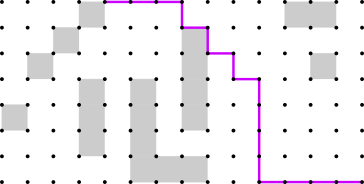
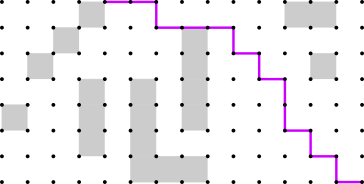
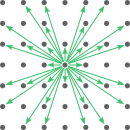
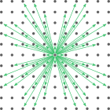

# Central64

Central64 is a header-only C++ library for approximating shortest paths through 2D grid-based environments. The library supports a variety of online path planning methods that do not require precomputation. All of the methods provide an option to produce **central** grid paths. All of the methods can be used with any of the standard rectangular grid neighborhoods up to **64** neighbors. See the [Central64 Technical Report](report/00-index.md) ([PDF](report/central64-technical-report.pdf)) for an overview of the methods and options supported by the library.

|Regular Grid Path|Central Grid Path|
|:-:|:-:|
|||

|4-Neighborhood|8-Neighborhood|16-Neighborhood|32-Neighborhood|64-Neighborhood|
|:-:|:-:|:-:|:-:|:-:|
||||||

## Purpose

The Central64 library is intended to be fast and flexible. All combinations of the following options are supported:

- *Neighborhood Size:* Choose between **4**, **8**, **16**, **32**, or **64** neighbors.
- *Grid Cell Alignment:* Choose between **center** and **corner** cell alignment.
- *Path Centralization:* Choose between **regular** grid paths selected arbitrarily, and **central** grid paths selected for directness by counting paths (see [explainer article](https://towardsdatascience.com/a-short-and-direct-walk-with-pascals-triangle-26a86d76f75f)).
- *Search Method:* Choose between **A\* Search**, **Jump Point Search**, **Bounded Jump Point Search**, **Mixed A\***, and **Mixed Jump Point Search**.
- *Smoothing Method:* Choose between **No Smoothing**, **Greedy Smoothing**, and **Tentpole Smoothing**.

The library was also designed to support an empirical comparison of these path planning techniques. Based on the results of the study, **16-Neighbor Bounded Jump Point Search with Tentpole Smoothing** is recommended as the combined method that provides the best overall balance of quality and speed. See the [Central64 Technical Report](report/00-index.md) ([PDF](report/central64-technical-report.pdf)) for details.

## How to Use

To use the Central64 library in another C++ project, add the [include](include) directory to your project's include path. Insert the line `#include <central64/PathPlanner.hpp>` into your source code to access the library's path planning capabilities. Central64 requires C++17 or higher.

To reference the library in a publication, please cite the [Central64 Technical Report](report/00-index.md) ([PDF](report/central64-technical-report.pdf)):

> Goldstein, R. (2023). The Central64 Library: An Overview and Comparison of Grid Path Planning Methods. Technical Report, Version 1. Autodesk Research. Code and report available at [https://github.com/Autodesk/Central64](https://github.com/Autodesk/Central64).

## Examples

The examples below demonstrate how to compute paths using the Central64 library.

* **High-Level Demo** ([HighLevelDemo.cpp](examples/HighLevelDemo.cpp)): Demonstrates the library's high-level features. The recommended path planner is used to plan paths between 4 pairs of endpoints. The example is simple and shows the primary function of the library. However, very few of the library's options are revealed.
* **Mid-Level Demo** ([MidLevelDemo.cpp](examples/MidLevelDemo.cpp)): Demonstrates the library's features at a moderate level of detail. A path planner is customized with various parameter values, then used to plan paths between 4 pairs of endpoints. The same path planner is also used to sample paths between 7 sample points and a common source point. The example is somewhat more complex than the high-level demo, but shows how to access more of the library's path planning options.
* **Low-Level Demo** ([LowLevelDemo.cpp](examples/LowLevelDemo.cpp)): Demonstrates the library's low-level features. A grid location is analyzed to determine its accessible neighbors. Various line-of-sight tests are performed. A grid-based search object is constructed and used to find a shortest grid path. A separate smoothing object is constructed and used to smooth the path. Various paths are sampled from a common source. The example is more complex than the other two, but shows how the various operations in a path planning process can be applied independently of one another.

Below is the code for [HighLevelDemo.cpp](examples/HighLevelDemo.cpp):

```cpp
#include <central64/PathPlanner.hpp>

using namespace central64;

void HighLevelDemo()
{
    // Prepare grid data.
    std::vector<std::vector<bool>> inputCells = {
        {0, 0, 0, 1, 0, 0, 0, 0, 0, 0, 0, 1, 1, 0},
        {0, 0, 1, 0, 0, 0, 0, 1, 0, 0, 0, 0, 0, 0},
        {0, 1, 0, 0, 0, 0, 0, 1, 0, 0, 0, 0, 1, 0},
        {0, 0, 0, 1, 0, 1, 0, 1, 0, 0, 0, 0, 0, 0},
        {1, 0, 0, 1, 0, 1, 0, 1, 0, 0, 0, 0, 0, 0},
        {0, 0, 0, 1, 0, 1, 0, 0, 0, 0, 0, 0, 0, 0},
        {0, 0, 0, 0, 0, 1, 1, 1, 0, 0, 0, 0, 0, 0},
    };

    // Create the recommended path planner
    auto planner = CreateBestOverallPathPlanner(inputCells);

    // Print grid.
    printf("Grid for High-Level Demo:\n");
    printf("%s\n", ToString(planner.Grid()).c_str());

    // Create path planning scenarios.
    std::vector<std::pair<Offset2D, Offset2D>> scenarios = {
        {{ 8,  1}, {13,  6}},
        {{ 0,  0}, {13,  6}},
        {{ 3,  6}, {10,  4}},
        {{ 0,  6}, {13,  4}}
    };

    // Solve path planning scenarios.
    std::vector<std::vector<Offset2D>> paths{};
    for (const auto& [sourceCoords, sampleCoords] : scenarios) {
        std::vector<Offset2D> pathVertices = planner.PlanPath(sourceCoords, sampleCoords);
        paths.push_back(pathVertices);
    }

    // Print paths.
    printf("Paths produced by recommended path planner:\n");
    for (const auto& pathVertices : paths) {
        printf("%s\n", ToString(pathVertices).c_str());
    }
    printf("\n");

    // Print grid with last planned path.
    printf("Grid with last planned path:\n");
    printf("%s\n", ToString(planner.Grid(), paths.back()).c_str());
}
```

The code produces the following output:

```
Grid for High-Level Demo:
+--+--+     +--+--+--+--+--+--+        +
|><|        |><|><|     |><|><|        |
+--+     +--+--+--+     +--+--+--+--+--+
|        |><|><|><|     |><|><|><|     |
+     +--+--+--+--+     +--+--+--+     +
|     |     |     |     |><|><|><|     |
+--+--+     +     +     +--+--+--+--+--+
   |><|     |     |     |><|><|><|><|><|
   +--+     +     +     +--+--+--+--+--+
   |><|     |     |     |><|><|><|><|><|
+--+--+     +     +--+--+--+--+--+--+--+
|><|><|     |           |><|><|><|><|><|
+--+--+--+--+           +--+--+--+--+--+

Paths produced by recommended path planner:
[8, 1], [13, 6]
[0, 0], [0, 3], [2, 3], [2, 2], [6, 2], [6, 5], [8, 5], [13, 6]
[3, 6], [4, 6], [4, 2], [6, 2], [6, 5], [8, 5], [10, 4]
[0, 6], [1, 5], [2, 3], [2, 2], [3, 2], [6, 0], [8, 0], [11, 3], [13, 4]

Grid with last planned path:
+--+--+     +--+--5--+--6--+--+        +
|><|        |><|><|     |><|><|        |
+--+     +--+--+--+     +--+--+--+--+--+
|        |><|><|><|     |><|><|><|     |
+     3--4--+--+--+     +--+--+--+     +
|     |     |     |     |><|><|><|     |
+--+--2     +     +     +--+--+--7--+--+
   |><|     |     |     |><|><|><|><|><|
   +--+     +     +     +--+--+--+--+--8
   |><|     |     |     |><|><|><|><|><|
+--1--+     +     +--+--+--+--+--+--+--+
|><|><|     |           |><|><|><|><|><|
0--+--+--+--+           +--+--+--+--+--+
```

## Learning Resources

### Definitive References

Below are the definitive references on the approaches that have been incorporated into the Central64 library.

* **Central64 Technical Report:**
  * [Read Online](report/00-index.md)
  * [Download PDF](report/central64-technical-report.pdf)
* **Central Grid Paths:** [Goldstein et al. (2022)](https://www.jair.org/index.php/jair/article/view/13544)
* **Standard Grid Neighborhoods:** [Rivera et al. (2020)](https://jair.org/index.php/jair/article/view/11383)
* **Canonical Grid Paths:** [Sturtevant & Rabin (2016)](https://www.ijcai.org/Abstract/16/103)
* **Jump Point Search:** [Harabor & Grastien (2011)](https://ojs.aaai.org/index.php/AAAI/article/view/7994)
* **Greedy Smoothing:** [Botea et al. (2004)](https://citeseerx.ist.psu.edu/viewdoc/summary?doi=10.1.1.112.314)
* **A\* Search:** [Hart et al. (1968)](https://ieeexplore.ieee.org/document/4082128)
* **Dijkstra's Algorithm:** [Dijkstra (1959)](https://link.springer.com/article/10.1007/BF01386390)

### Recommended Tutorials

The following resources use illustrations or interactive graphics to explain grid path planning algorithms.

* **Central Grid Path Tutorial:**
  * [A Short and Direct Walk with Pascal's Triangle](https://towardsdatascience.com/a-short-and-direct-walk-with-pascals-triangle-26a86d76f75f) - Rhys Goldstein, published by Towards Data Science
* **Dijkstra/A\* Tutorials:**
  * [Introduction to the A* Algorithm](https://www.redblobgames.com/pathfinding/a-star/introduction.html) - Amit Patel, Red Blob Games
  * [Implementation of A*](https://www.redblobgames.com/pathfinding/a-star/implementation.html) - Amit Patel, Red Blob Games
  * [A* Map Demo](https://movingai.com/SAS/ASM/) - Moving AI Lab
  * [Pathfinding Visualizer](https://clementmihailescu.github.io/Pathfinding-Visualizer/) - Clement Mihailescu
* **Jump Point Search Tutorials:**
  * [A Visual Explanation of Jump Point Search](https://zerowidth.com/2013/a-visual-explanation-of-jump-point-search.html) - Nathan Witmer's Blog
  * [Canonical Orderings on Grid Maps](https://www.movingai.com/SAS/JPS/) - Moving AI Lab
  * [Fast Pathfinding via Symmetry Breaking](https://harablog.wordpress.com/2011/08/26/fast-pathfinding-via-symmetry-breaking/) - Daniel Harabor's Blog
  * [Jump Point Search](https://harablog.wordpress.com/2011/09/07/jump-point-search/) - Daniel Harabor's Blog

### Related Projects

Like Central64, the following projects provide or compare implementations of various path planning methods.

* [Nathan Sturtevant's HOG2 Pathfinding Testbed](https://github.com/nathansttt/hog2)
* [Tansel Uras and Sven Koenig's Any-Angle Pathfinding Library](http://idm-lab.org/anyangle)
* [Shunhao Oh's Any-Angle Pathfinding Repository](https://github.com/Ohohcakester/Any-Angle-Pathfinding)
* [Daniel Harabor's Pathfinding Repository](https://bitbucket.org/dharabor/pathfinding/src/master/)
* [Moving AI Lab's Grid-Based Path Planning Competition](https://movingai.com/GPPC/)

## Advanced Instructions

### Documentation Instructions

The following instructions generate documentation from the code using Doxygen:

* Open a command prompt and go to the root directory of the project.
* `doxygen doxygen.config`
* Open "doc/html/index.html" in a web browser.

The following instructions regenerate the PDF version of the report using Visual Studio Code with the Markdown PDF extension:

* Open a command prompt and go to the root directory of the project.
* `cd report`
* `python generate-pdf-source.py`
* In Visual Studio Code, under "Extensions", right-click Markdown PDF. Select "Extension Settings" and change the Header Template to `<span class='title' style='display: none;'></span>`.
* Open "central64-technical-report.md" in Visual Studio Code.
* Right-click and select "Markdown PDF: Export (pdf)".
* The generated PDF should replace the file [report/central64-technical-report.pdf](report/central64-technical-report.pdf).

### Build Instructions

Building the Central64 project is necessary only to run the examples or analyze the various methods. Otherwise, simply include the header files in your project as outlined in the [How to Use](#how-to-use) section. Below are instructions for building the examples and analysis code using CMake and Visual Studio 2019:

* Open a command prompt and go to the root directory of the project.
* `mkdir build`
* `cd build`
* `cmake -G "Visual Studio 16 2019" -A x64 ..`
* Open "Central64.sln".
* Build the solution.
* Run `Debug/Central64Examples.exe` or `Release/Central64Examples.exe` to test. The output should match [results/examples.txt](results/examples.txt).

### Analysis Instructions

Below are additional instructions for analyzing the *Dragon Age: Origins* maps and scenarios [distributed by the Moving AI Lab](https://movingai.com/benchmarks/grids.html) with permission from [BioWare](https://www.bioware.com/). Other Moving AI Lab benchmarks can be analyzed in a similar manner.

* Open a command prompt and go to the root directory of the project.
* `mkdir benchmarks`
* `cd benchmarks`
* `mkdir dao` (for *Dragon Age: Origins*)
* Visit [https://movingai.com/benchmarks/grids.html](https://movingai.com/benchmarks/grids.html).
* Download and extract all maps and benchmark problems for *Dragon Age: Origins*, and place all files in the "dao" directory.
* `cd ..`
* `cd build`
* Run `Release/Central64Analysis.exe heuristic partial ../benchmarks/dao/arena.map 111` to view paths produced by assorted methods for one map ("arena.map") and one scenario (scenario 111, numbering from 0).
* Run `Release/Central64Analysis.exe heuristic partial ../benchmarks/dao/arena.map` to compute mean path lengths and runtimes for one map and all scenarios.
* Run `Release/Central64Analysis.exe heuristic partial ../benchmarks/dao` to compute mean path lengths and runtimes for all maps and scenarios in the benchmark set.
* Replace `partial` with `complete` to test all search and smoothing methods with all neighborhoods.
* Replace `heuristic` with `dijkstra` to test the all-nodes version of each path planning method (e.g. the all-nodes version of A\* Search is Dijkstra Search). For this type of analysis, benchmark scenarios are grouped in sets of 13 (26 vertices). An all-nodes search is performed using the first vertex as the source, then paths are sampled for each of the next 25 vertices.

An alternative way of performing analyses is to run the Python scripts in the [results](results) directory. These scripts are designed to conduct particular experiments, some of which are intended for the technical report. Running the scripts regenerates the output files in the same directory. When these results are regenerated, the average runtimes will change but the other statistics should remain the same. The instructions for running the scripts are as follows:

* Open a command prompt and go to the root directory of the project.
* `cd results`
* `python 00-run-examples.py` (similarly for the other scripts)

The individual scripts are described below:

* **Run Examples** ([00-run-examples.py](results/00-run-examples.py)): Runs the examples and outputs the results to [results/examples.txt](results/examples.txt). No benchmark data is required.
* **Run Partial Analyses** ([01-run-partial-analyses.py](results/01-run-partial-analyses.py)): Runs assorted methods on a small selection of *Dragon Age: Origins* maps. The maps and associated scenarios must be placed in a directory named "benchmarks/dao". The generated output files begin with "analysis-heuristic-partial" and "analysis-dijkstra-partial".
* **Run Complete Analyses** ([02-run-complete-analyses.py](results/02-run-complete-analyses.py)): Runs the complete set of methods on the complete set of *Dragon Age: Origins* maps. The maps and associated scenarios must be placed in a directory named "benchmarks/dao". This script was used to generate the empirical study data for the technical report. The results are output to [results/analysis-heuristic-complete-dao.txt](results/analysis-heuristic-complete-dao.txt) and [results/analysis-dijkstra-complete-dao.txt](results/analysis-dijkstra-complete-dao.txt).
* **Process Complete Analyses** ([03-process-complete-analyses.py](results/03-process-complete-analyses.py)): Processes the complete analysis results to produce plots and tables for the technical report. The generated output files begin with "plot-heuristic-dao", "table-heuristic-dao", "plot-dijkstra-dao", and "table-dijkstra-dao".

## How to Contribute

Please see [CONTRIBUTING.md](CONTRIBUTING.md) if you are interesting in improving the Central64 library.

