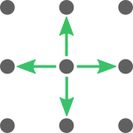
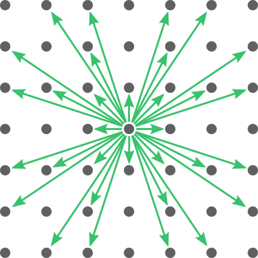
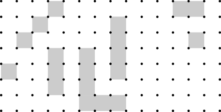
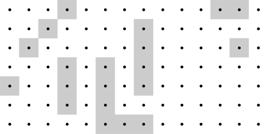
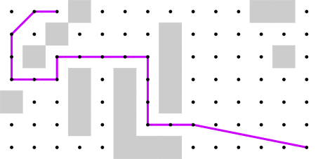
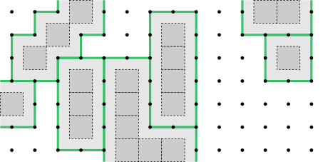

| [Prev](01-introduction.md) | [Next](03-paths.md) |
## 2. Grids

The Central64 library represents spatial environments using 2D rectangular grids with a spacing of 1 along both axes. The library offers a choice of five standard grid neighborhoods and two cell alignment options.

### 2.1 Neighborhoods

Grid paths can be viewed as sequences of moves between neighboring vertices, and the set of possible moves is determined by the grid neighborhood. Central64 provides neighborhoods with 4, 8, 16, 32, or 64 moves. Larger neighborhoods lead to shorter, higher quality paths, though in most cases these paths will take longer to compute.

The ***4-neighborhood*** below includes only the 4 cardinal moves, each of which is 1 grid spacing in length. This neighborhood is useful for certain applications such as tile-based video games, but is not recommended for approximating highly direct paths.

The widely used ***8-neighborhood*** includes the 4 cardinal moves plus 4 diagonal moves.

Below is the ***16-neighborhood***. Observe that each successive neighborhood includes all the moves of the previous neighborhood, plus an equal number of additional moves. These additional moves are vector sums of the two surrounding moves.

The ***32-neighborhood*** is below.

And below is the ***64-neighborhood***, the largest neighborhood supported by the Central64 library. This neighborhood produces the highest quality paths at the expense of requiring the longest computation times.

The standard rectangular neighborhoods are examined in detail by [Rivera et al. (2020)](https://jair.org/index.php/jair/article/view/11383), who refer to them as the "2^*k* neighborhoods" since the number of neighbors is always a power of 2. The Central64 library uses Algorithm 1 from their paper to compute the minimum possible grid distance between any two vertices for up to 64 neighbors. This minimum possible distance may be referred to as the "2^*k* heuristic" or the "standard grid distance".

### 2.2 Cell Alignment

Central64 takes as input a spatial environment in the form of a rectangular array of cells, each of which is either traversable or blocked. Clusters of blocked cells represent obstacles that must be circumnavigated by paths. Below is an example of a spatial environment represented by traversable (white) and blocked (gray) cells.

Inevitably, a decision must made on how these "cells" should align with the "vertices" described earlier in this section. The Central64 library offers two such cell alignment options: corner alignment and center alignment. With ***corner*** alignment, vertices are placed on the corners of cells as shown below.

If the corner alignment option is selected, Central64 allows paths to go from one vertex to the next as long as there is a line-of-sight connection between them. Two vertices have a line-of-sight connection if the straight line between them does not pass through any obstacles. With corner-aligned cells, a path is permitted to contact an obstacle at a point or on one side. It may even pass through a single-point gap between two diagonally adjacent blocked cells. These are the conventions used by [Uras & Koenig (2015)](https://ojs.aaai.org/index.php/SOCS/article/view/18382) for the [anyangle](http://idm-lab.org/anyangle) path planning library. Below is an example of a shortest path on a corner-aligned grid.

With ***center*** alignment, vertices are placed on the centers of cells.

If the center alignment option is selected, Central64 takes a more conservative approach when finding paths. In essence, an agent that might travel the path is assumed to be as large as a grid cell rather than as small as a single point. In other words, it must be possible to continuously translate a 1-cell square from the start of the path to the end such that the square may contact but never overlap any obstacle. This is the convention used by [Hu et al. (2021)](https://jair.org/index.php/jair/article/view/12255), for example. It is also the default option for the Central64 library, if the cell alignment is not explicitly specified. Below is an example of a shortest path on a center-aligned grid, according to these rules.

Although the corner alignment and center alignment options differ greatly in terms of the paths they allow or disallow, they have little bearing on how the various path planning methods are implemented. In the Central64 library, the only algorithmic code that differs from one option to the other lies within a line-of-sight function that checks whether two grid vertices are mutually visible. A simple trick ensures that the vast majority of the library's path planning code can be repurposed for both conventions. The trick is to convert an array of center-aligned cells into an array of corner-aligned cells by enlarging the obstacles by half a grid spacing in both dimensions. This operation is illustrated below. The dark gray squares with dotted lines are the original center-aligned blocked cells, and the light gray areas are the enlarged obstacles represented using corner-aligned cells.

The result of this operation is that, regardless of which cell alignment convention is selected by the user of the library, there is always a set of corner-aligned cells available within the library. Most line-of-sight checks are performed using these corner-aligned cells. The one technicality is that, for the center alignment option, line-of-sight checks in the 4 cardinal directions must use the original center-aligned cells. The reason for this exception is to ensure that the boundaries of the enlarged obstacles, shown in green above, are traversable. Observe that the green lines between obstacles in the diagram should not be "filled in".

The technique of enlarging obstacles is well known. It was described by [Lozano-Pérez & Wesley (1979)](https://dl.acm.org/doi/10.1145/359156.359164) for polygonal obstacles.

An in-depth analysis of center vs. corner alignment is provided by [Bailey et al. (2015)](https://ojs.aaai.org/index.php/AIIDE/article/view/12808).

| [Prev](01-introduction.md) | [Next](03-paths.md) |
