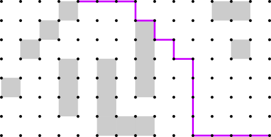
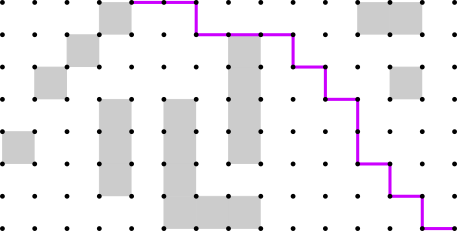
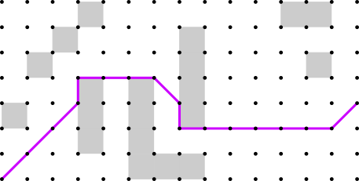
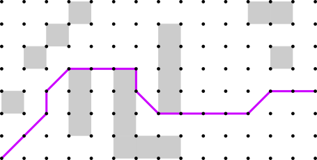
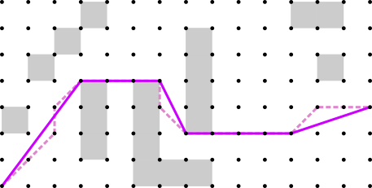
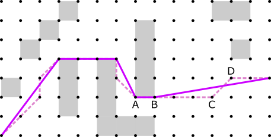
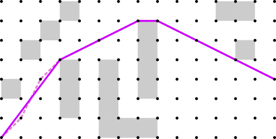

| [Prev](02-grids.md) | [Next](04-search-methods.md) |
## 3. Paths

In general, a path is any directed curve which stretches from one point to another without intersecting itself or passing through obstacles. In Central64, paths head in straight lines from one grid vertex to the next. A grid path is a special type of path that, as previously stated, includes only moves that belong to the neighborhood. For example, an 8-neighbor grid path may include only cardinal and diagonal moves between successive vertices. Central64 provides a centralization option for selecting relatively direct grid paths. The library also offers two smoothing methods that modify a path to make it shorter and more direct.

### 3.1 Path Centralization

Central64 computes shortest grid paths, and it is well known that there can be a multitude of shortest grid paths between a pair of endpoints. It is common practice to select a single solution in an arbitrary fashion, which usually results in a noticeably indirect path. Below is one such ***regular*** grid path, produced by Central64's implementation of Regular A*. This example uses the 4-neighborhood.

An alternative way of selecting a shortest grid path is to count the number of shortest grid paths that traverse each vertex, and then select the vertices with the highest counts. The Central64 library's path centralization option enables this approach, which may be referred to as "path planning with counting" or "central grid path planning". The result is a ***central*** grid path. Below is a 4-neighbor central path computed using the same endpoints as the regular grid path above, but with the centralization option turned on. The purpose of central path planning is to obtain a more direct grid path, as can be observed in the example.

Here is another example of a regular shortest grid path, this time using the 8-neighborhood.

And below is the central path produced for the same scenario. Observe that the diagonal move toward the right side of the path occurs closer to the middle of the obstacle-free region.

Central grid path planning is a computationally efficient way to obtain highly direct grid paths, especially for long, meandering paths on high-resolution grids. It solves the [ugly path problem](https://www.redblobgames.com/pathfinding/a-star/implementation.html#troubleshooting-ugly-path) pointed out by [Patel (2020a)](https://www.redblobgames.com/pathfinding/a-star/implementation.html) and others. The path counting technique was introduced by [Goldstein et al. (2022)](https://jair.org/index.php/jair/article/view/13544), who explain how the classic Dijkstra and A* search procedures can be modified to produce a directed acyclic graph of all possible shortest grid paths between two endpoints. The directed acyclic graph is used to count paths and select a central path.

The Central64 library uses a slightly different approach to path counting from the one proposed by [Goldstein et al. (2022)](https://jair.org/index.php/jair/article/view/13544). Central64 begins with a traditional path search, meaning that the search produces a tree of shortest grid paths instead of a directed acyclic graph. The directed acyclic graph is constructed after search by traversing the grid path costs (g-costs). The g-cost traversal is performed from the goal back to the source. It relies on the following observation about any two neighboring vertices P and Q: If the increase in g-cost from P to Q is exactly the cost of traveling from P to Q, then P is a predecessor of Q. Constructing the directed acyclic graph from the g-costs in a post-search step makes it easy to apply the path counting technique to a wide range of search methods. In additional to Central Dijkstra and Central A*, the Central64 library implements Central Canonical Dijkstra, Central Jump Point Search, and variations of these methods.

### 3.2 Path Smoothing

Since grid paths tend to be jagged or indirect, it is common practice to smooth them using a post-processing operation. Central64 offers two smoothing methods, Greedy Smoothing and Tentpole Smoothing.

***Greedy Smoothing*** refers to the well-known algorithm described by [Botea et al. (2004)](https://citeseerx.ist.psu.edu/viewdoc/summary?doi=10.1.1.112.314), which removes path vertices according to a succession of line of sight checks. First, a vertex at one end of the path is selected as the current vertex. Next, a line of sight check is performed from the current vertex to each subsequent vertex until the line of sight is broken or the end of the path is reached. The vertex at the end of the longest unbroken sightline becomes the current vertex, and all vertices between are removed from the path. The process then repeats with the new current vertex.

An example of Greedy Smoothing is shown below, where the dashed line is the original grid path and the solid line is the smoothed path. The smoothing was performed from left to right. The smoothed path is shorter and more direct, but the algorithm failed to remove a few unnecessary path vertices toward the right side of the diagram.

***Tentpole Smoothing*** is a new and enhanced version of Greedy Smoothing. The method proceeds in a similar fashion, performing a succession of line of sight checks from the current vertex to subsequent path vertices. When a line of sight check fails, however, an additional backtracking step is performed to select the best "tentpole" location.

An example of tentpole smoothing is shown below. When the current vertex is A, the succession of line of sight checks is broken when the line from A to D is tested. The point at C then becomes the initial tentpole location: the bend in the tent-shaped section of the path between A and D. But whereas the greedy method would select this tentpole location and move on, the tentpole method examines other tentpole locations. Specifically, it examines each vertex from C back to A, stopping early if the line of sight to D is broken. It then selects the tentpole location yielding the shortest distance from A to D. In this case, the optimal tentpole location is B. The method then proceeds with B as the current vertex.

Other smoothing techniques include the "string pulling" method by [Han et al. (2020)](https://ojs.aaai.org/index.php/SOCS/article/view/18541), which attempts to produce a taut path by inserting new vertices into the path as well as removing existing vertices, and the HVG algorithm by [Kumar et al. (2022)](https://ojs.aaai.org/index.php/ICAPS/article/view/19816) that constructs a visibility graph around the path. The tentpole smoothing method is appealing in that it retains much of the simplicity of the original greedy method while eliminating the most conspicuous anomalies.

It is worth noting that none of the paths in the previous two examples are truly the shortest path. For this scenario, the shortest path can be obtained by switching from the 8-neighborhood to the 16-neighborhood and then applying either smoothing algorithm. The result is below. 

Notice that the shortest path has a different topology than the previous solutions, meaning that it goes a different way around one of the obstacles. Choosing a larger neighborhood or turning on path centralization may change the topology of a path, but smoothing a path leaves the topology unchanged. 

| [Prev](02-grids.md) | [Next](04-search-methods.md) |
