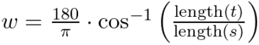
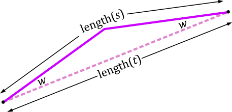

| [Prev](06-library-design.md) | [Next](08-search-results.md) |
## 7. Experiment Design

The Central64 library was developed in large part to support an experiment comparing various combinations of search and smoothing methods, using different neighborhoods, with and without path counting. The experiment made use of a standard benchmark set, involved a total of 200 distinct methods, and generated scores for runtime and path quality.

### 7.1 Benchmarks

The experiment was conducted using the *Dragon Age: Origins* (DAO) benchmark set for 2D grid-based pathfinding, one of several benchmark sets described by [Sturtevant (2012)](https://ieeexplore.ieee.org/document/6194296). The map data and test scenarios are distributed by the [Moving AI Lab](https://movingai.com/benchmarks/grids.html) with permission from [BioWare](https://www.bioware.com/). 

The DAO benchmark set consists of 156 maps, ranging in dimensions from 22x28 to 1260x1104 vertices. Although the map data was prepared assuming center-aligned grid cells, this experiment interprets the maps using the corner alignment convention. The use of corner-aligned cells allows the non-normalized results of the experiment, reported in the appendix, to be compared with the results produced by [Uras & Koenig (2015)](https://ojs.aaai.org/index.php/SOCS/article/view/18382) and [Goldstein et al. (2022)](https://jair.org/index.php/jair/article/view/13544).

### 7.2 Methods

The following methods and options were tested in every combination.

- Neighborhood Sizes (5 options): 4, 8, 16, 32, or 64
- Path Centralization (2 options): Regular or Central
- Search Methods (5 options): A\* Search, Jump Point Search, Bounded Jump Point Search, Mixed A\*, or Mixed Jump Point Search.
- Smoothing Method (2 options): Greedy Smoothing or Tentpole Smoothing.

The result was 5 x 2 x 5 x 2 = 100 distinct heuristic methods applied to every scenario in the benchmark set. A corresponding set of 100 distinct all-nodes methods were also tested.

To test the all-nodes variants of the five methods (Dijkstra Search, Canonical Dijkstra Search, Bounded Canonical Dijkstra Search, Mixed Dijkstra Search, Mixed Canonical Dijkstra Search), the scenarios were grouped in sets of 13 (except for the last group associated with each map, which was permitted to have fewer than 13 scenarios). Since each scenario consists of a source and goal, there were 26 vertices in each group. The first of the 26 vertices was used as a common source, and an all-nodes search was performed on this vertex. Paths were then sampled for the remaining 25 (or fewer) vertices. In some cases there was no route between the sample vertex and the common source; these paths were excluded from the metrics.

To simplify the experiment, the jump cost for Bounded Jump Point Search and Bounded Canonical Dijkstra Search was fixed at 8. The block size was also fixed at 8-by-8 for all of the mixed search methods.

### 7.3 Metrics

For each method, two metrics were obtained: the mean length of a path and the mean runtime required to compute a path. Both metrics were computed by first averaging over all the scenarios associated with each map, and then averaging over all maps in the benchmark set. The final path length and runtime metrics are reported in the appendix.

To make the results easier to interpret, the plots presented in the following sections use normalized path lengths and runtimes. Runtimes are normalized by dividing the mean runtime of the evaluated method with the mean runtime of a "standard" method. The typical 8-Neighbor A* Search with Greedy Smoothing was chosen as the standard method for comparing heuristic searches, and the corresponding variation of Dijkstra Search was used to normalize the all-nodes runtimes.

Path lengths are normalized using an original technique intended to make path quality scores easier to interpret. The technique converts a ratio of path lengths into an angular suboptimality score measured in degrees. The concept is that an easily noticeable angle, such as 5 degrees, indicates a low-quality path that deviates noticeably from a path that is considered optimal. A barely noticeable angle, such as 1 degree, indicates a high-quality path that barely deviates from optimality.

If *s* is the path that is being evaluated, and *t* is a path that is considered optimal, then the angular suboptimality *w* is calculated by taking the arccosine of the length of *t* to the length of *s* and then converting the result to degrees.

If the optimal path *t* is a straight line, and if the evaluated path *s* is a tent-shaped polyline that reaches the maximum possible deviation from the sightline at the halfway point, then the angular suboptimality *w* is the angle between the two paths measured at either end.

Ideally, the optimal path length should be the length of an absolute shortest path. However, since Central64 does not implement an exact shortest path solver, the optimal path length used in the experiment is the mean length computed for 64-Neighbor Central Bounded Jump Point Search followed by Tentpole Smoothing. For the heuristic methods and the selected benchmark set, the smoothed 64-neighbor central paths differ in length from the [anyangle](http://idm-lab.org/anyangle) library's absolute shortest paths by less than 0.001%. This suggests that the approximate angular suboptimality scores reported in this experiment are sufficiently accurate for comparing practical solvers that trade some degree of quality for speed.

| [Prev](06-library-design.md) | [Next](08-search-results.md) |
