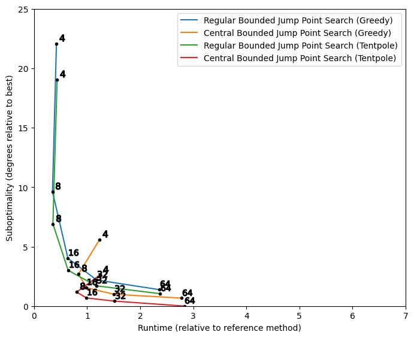

| [Prev](07-experiment-design.md) | [Next](09-all-nodes-search-results.md) |
## 8. Search Results

The results for 5 neighborhoods x 2 path centralization options x 2 path smoothing options (= 20 variations) are plotted for each of the five heuristic search methods. The x-axes represent average runtime relative to 8-Neighbor A* Search with Greedy Smoothing. Lower runtime scores indicate greater speed. The y-axes represent average angular suboptimality scores relative to 64-neighbor central grid paths post-processed with Tentpole Smoothing. Lower suboptimality scores indicate higher quality paths. The most practical combinations of methods are those appearing near the bottom-left corner of the plots. Methods that differ only by neighborhood size are connected by lines.

### 8.1 A* Search Results

The results for A* are plotted below.

The plot shows that, consistent with [Rivera et al. (2020)](https://jair.org/index.php/jair/article/view/11383), doubling the neighborhood size usually leads to an improvement in path quality at the expense of longer runtimes. The exception to this rule is the transition from the 4-neighborhood to the 8-neighborhood, which in some cases improves both quality and runtime. Similar trends can be observed for the other four search methods.

The plot also shows that Tentpole Smoothing provides a clear advantage over Greedy Smoothing. The new tentpole method produces an appreciable improvement in path quality, while the associated increase in runtime is practically insignificant. The same observation can be made for all tested search methods.

The plot shows that central grid path planning leads to a dramatic improvement in path quality in exchange for a moderate increase in runtime. Switching from regular to central path planning shortens the average length of the final smoothed paths to a greater degree than doubling the neighborhood size or switching from Greedy to Tentpole Smoothing. Also, unless one is using the 4-neighborhood, it is generally less costly in terms of runtime to add path counting than it is to double the neighborhood size.

For the 8-neighborhood and Greedy Smoothing, switching to central path planning causes a 45% increase in runtime, which is slightly more than the 36% increase one may derive from the experiment by [Goldstein et al. (2022)](https://jair.org/index.php/jair/article/view/13544). The difference may be due to the extra step of deriving the directed acyclic graph from the g-costs, or it may be a result of other differences between the two implementations.

### 8.2 Jump Point Search Results

Jump Point Search is found to be roughly twice as fast as A* Search, which is slightly less impressive than the roughly 3-fold speedup reported by [Sturtevant & Rabin (2016)](https://www.ijcai.org/Abstract/16/103) and [Rivera et al. (2020)](https://jair.org/index.php/jair/article/view/11383).

It is unconventional to use Jump Point Search with the 4-neighborhood, and the plot shows that the 8-neighborhood leads to shorter smoothed paths and shorter runtimes. The 4-neighborhood is particularly slow for Central Jump Point Search. Nevertheless, if the desired output is a regular or central 4-neighbor grid path, then Jump Point Search offers a small but noticeable speed advantage over A*.

### 8.3 Bounded Jump Point Search Results

The results for Bounded Jump Point Search are similar to those of Jump Point Search. A subsequent plot will show that bounding the jump cost produces a small but noticeable improvement in runtime.

### 8.4 Mixed A* Search Results

Mixed A* Search is found to be the slowest of the five tested search methods. Observe that the x-axis of the plot has been scaled relative to the other plots to fit the 64-neighbor results.

### 8.5 Mixed Jump Point Search Results

The results of Mixed Jump Point Search exhibit the same basic trends as the other two Jump Point Search methods. A subsequent plot will reveal, however, that this mixed variant of Jump Point Search is slower than the existing alternatives.

### 8.6 Comparison of Search Methods

The plot below overlays the results of four of the above methods. Mixed A* Search is excluded since it is not competitive with the other four. The Greedy Smoothing results are also excluded since Tentpole Smoothing is a clear improvement. The x-axis and y-axis are scaled to focus on the most practical method variations, the variations that achieve a balance of quality and speed.

The plot shows that Bounded Jump Point Search is the fastest method, though it is only marginally faster than Jump Point Search. The advantage of jumping is somewhat less pronounced for central path planning than regular path planning, since jumping accelerates the search without accelerating the subsequent path counting step.

Based on the subjective notion that an angle of around 1 degree is "barely noticeable", the two methods which stand out are the 8-neighbor and 16-neighbor variations of Central Bounded Jump Point Search. Between these two options, the 16-neighbor variation appears to offer a significant improvement in quality in exchange for a small loss of speed. The 16-Neighbor Central Bounded Jump Point Search with Tentpole Smoothing variation is nearly identical in runtime to the standard 8-Neighbor Regular A* Search with Greedy Smoothing combination, but achieves a roughly 10-fold reduction in angular suboptimality.

| [Prev](07-experiment-design.md) | [Next](09-all-nodes-search-results.md) |
