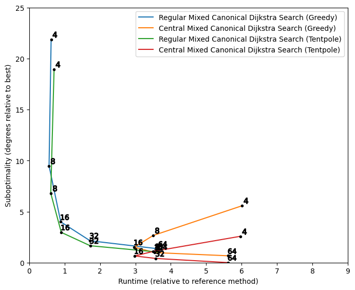
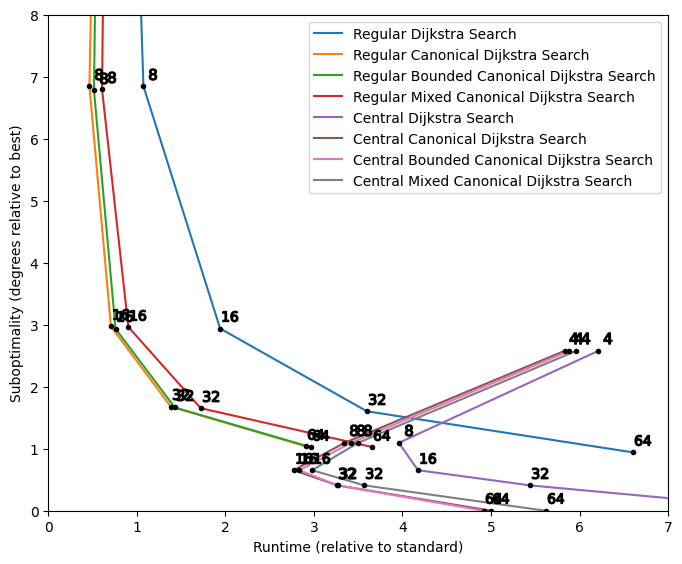

| [Prev](08-search-results.md) | [Next](10-findings-and-recommendations.md) |
## 9. All-Nodes Search Results

The results for 5 neighborhoods x 2 path centralization options x 2 path smoothing options (= 20 variations) are plotted for each of the five all-nodes search methods. The x-axes represent average runtime relative to 8-Neighbor Dijkstra Search with Greedy Smoothing. The y-axes represent average angular suboptimality scores relative to 64-neighbor central grid paths post-processed with Tentpole Smoothing. The benchmark data was not intended for testing all-nodes search methods, and the decision to sample 25 paths for each all-nodes search is arbitrary. Nevertheless, the resulting data should provide some insight into the relative performance of the various methods for applications where many paths share a common endpoint.

### 9.1 Dijkstra Search Results

The results for Dijkstra Search are plotted below.

The plot shows the expected tradeoff between quality and runtime when the neighborhood size is increased. It also shows the expected benefits of Tentpole Smoothing over Greedy Smoothing.

Switching from regular to central path planning causes a greater relative increase in runtime for Dijkstra Search than for A* Search. This is due to the fact that the path counting step must now be performed 25 times for every search. It should be noted, however, that the runtime cost of extracting a path from a completed all-nodes search is generally small and may not be of practical importance. That said, the plot suggests that Central Dijkstra is best performed using the 16-neighborhood if possible. For smaller neighborhoods, particularly the 4-neighborhood, any improvement in search speed is offset by the increased runtime cost of path counting. Similar trends can be observed for the other four all-nodes search methods.

### 9.2 Canonical Dijkstra Search Results

Regular Canonical Dijkstra Search is found to be roughly twice as fast as Regular Dijkstra Search, whereas Central Canonical Dijkstra Search is somewhat faster than Central Dijkstra Search.

### 9.3 Bounded Canonical Dijkstra Search Results

The performance of Bounded Canonical Dijkstra Search is virtually indistinguishable from that of Canonical Dijkstra Search.

### 9.4 Mixed Dijkstra Search Results

Mixed Dijkstra Search is the slowest of the tested all-nodes methods. The x-axis of the plot has been scaled relative to the other plots to fit the 64-neighbor results.

### 9.5 Mixed Jump Point Search Results

The results of Mixed Canonical Dijkstra Search exhibit the same basic trends as the other two Canonical Dijkstra Search methods. A subsequent plot will reveal that this mixed variant of Canonical Dijkstra is slower than the existing alternatives.

### 9.6 Comparison of All-Nodes Search Methods

The plot below overlays the results of four of the above methods. Mixed Dijkstra Search is excluded along with all variations that use Greedy Smoothing. The x-axis and y-axis are scaled to focus on the most practical method variations, the variations that achieve a balance of quality and speed.

Although there is an appreciate loss of speed associated with the central path planning methods, the 16-neighbor and 32-neighbor variations of Central Canonical Dijkstra Search and Central Bounded Canonical Dijkstra Search stand out as reasonably fast variations that produce high quality paths. Between these two options, 32-Neighbor Bounded Canonical Dijkstra Search with Tentpole Smoothing offers a significant improvement in path quality in exchange for a modest relative increase in runtime. On the other hand, the quality of a smoothed 16-neighbor central grid path is likely more than adequate for most applications. 

| [Prev](08-search-results.md) | [Next](10-findings-and-recommendations.md) |
