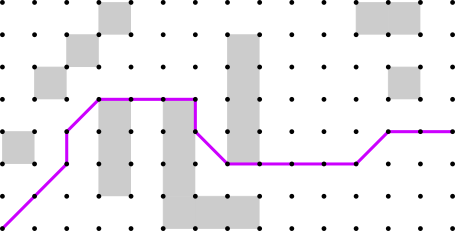

# The Central64 Library: An Overview and Comparison of Grid Path Planning Methods

Technical Report, Version 1

Rhys Goldstein, Autodesk Research

August 2023

## Executive Summary

This report explains the main concepts underlying the Central64 library, and presents an empirical comparison of the various supported path planning methods and variations. The project has several notable features. First, it demonstrates how central grid path planning can be applied not only to A* and Dijkstra's algorithm, but also to variations of Jump Point Search. Second, the library allows the standard rectangular grid neighborhoods up to 64 neighbors to be used in conjunction with all of the implemented methods. Third, a new path smoothing method called Tentpole Smoothing is introduced as an improvement over the traditional Greedy Smoothing algorithm. Based on the empirical study, 16-Neighbor Central Bounded Jump Point Search with Tentpole Smoothing is recommended as the combined method that provides the best overall balance of quality and speed. Several additional recommendations are made based on the empirical results and lessons learned from the project.

**Suggested citation:**

> Goldstein, R. (2023). The Central64 Library: An Overview and Comparison of Grid Path Planning Methods. Technical Report, Version 1. Autodesk Research. Code and report available at [https://github.com/Autodesk/Central64](https://github.com/Autodesk/Central64).

**Additional notes:**

An online version of this report can be found via the URL above. The experiment was run with `v1.0.0` of the code. Thanks to Jenmy Zhang from Autodesk Research for helping to clarify and improve this work.

## Table of Contents

- [1. Introduction](#1-introduction)
- [2. Grids](#2-grids)
- [3. Paths](#3-paths)
- [4. Search Methods](#4-search-methods)
- [5. All-Nodes Search Methods](#5-all-nodes-search-methods)
- [6. Library Design](#6-library-design)
- [7. Experiment Design](#7-experiment-design)
- [8. Search Results](#8-search-results)
- [9. All-Nodes Search Results](#9-all-nodes-search-results)
- [10. Findings and Recommendations](#10-findings-and-recommendations)
- [References](#references)
- [Appendix](#appendix)

## 1. Introduction

Central64 is a C++ library for approximating shortest paths through 2D grid-based environments. The library supports all combinations of the following options:

* Grids may have **4**, **8**, **16**, **32**, or **64** neighbors.
* Grids may use **center** or **corner** cell alignment.
* Grid paths may be **regular** or **central**.
* Grid paths may be found using **A\* Search**, **Jump Point Search**, **Bounded Jump Point Search**, **Mixed A\***, or **Mixed Jump Point Search**.
* Grid paths may be post-processed using **No Smoothing**, **Greedy Smoothing**, or **Tentpole Smoothing**.

The Central64 library focuses on relatively basic grid-based navigation techniques in which a shortest grid path search is initiated from a source vertex and terminated (a) shortly after reaching a goal vertex or (b) after visiting all reachable nodes. The library does not include methods that require sophisticated precomputations to be performed on the environment. In other words, the library is dedicated to "online" path planning methods. The project also excludes "any-angle" path planning approaches that perform line-of-sight checks or travel cost interpolations during the search procedure. All paths produced by Central64 are generated by conducting a grid path search and then, if desired, smoothing the result.

One of the main purposes of the Central64 library is to analyze the performance of the central grid path planning approach, in which a path counting operation is used to select highly direct grid paths. Central grid path planning was introduced by [Goldstein et al. (2022)](https://jair.org/index.php/jair/article/view/13544), who also presented an experiment focused primarily on the 8-neighborhood, the A* Search method, and the Greedy Smoothing algorithm. Central64 is a completely separate implementation of the central path approach. The Central64 library (1) supports all standard rectangular neighborhoods up to 64 neighbors, (2) applies path counting to alternative search algorithms including variations of Jump Point Search and two "mixed" search methods, and (3) introduces a more effective smoothing algorithm called Tentpole Smoothing.

This report explains the various path planning options supported by the Central64 library, and presents an experiment in which a total of 200 distinct variations of path planning methods are tested on the *Dragon Age: Origins* benchmark set. A number of findings and recommendations are put forward based on the results of the experiment as well as informal observations made during the development of the library.

## 2. Grids

The Central64 library represents spatial environments using 2D rectangular grids with a spacing of 1 along both axes. The library offers a choice of five standard grid neighborhoods and two cell alignment options.

### 2.1 Neighborhoods

Grid paths can be viewed as sequences of moves between neighboring vertices, and the set of possible moves is determined by the grid neighborhood. Central64 provides neighborhoods with 4, 8, 16, 32, or 64 moves. Larger neighborhoods lead to shorter, higher quality paths, though in most cases these paths will take longer to compute.

The ***4-neighborhood*** below includes only the 4 cardinal moves, each of which is 1 grid spacing in length. This neighborhood is useful for certain applications such as tile-based video games, but is not recommended for approximating highly direct paths.


The widely used ***8-neighborhood*** includes the 4 cardinal moves plus 4 diagonal moves.


Below is the ***16-neighborhood***. Observe that each successive neighborhood includes all the moves of the previous neighborhood, plus an equal number of additional moves. These additional moves are vector sums of the two surrounding moves.


The ***32-neighborhood*** is below.


And below is the ***64-neighborhood***, the largest neighborhood supported by the Central64 library. This neighborhood produces the highest quality paths at the expense of requiring the longest computation times.


The standard rectangular neighborhoods are examined in detail by [Rivera et al. (2020)](https://jair.org/index.php/jair/article/view/11383), who refer to them as the "2^*k* neighborhoods" since the number of neighbors is always a power of 2. The Central64 library uses Algorithm 1 from their paper to compute the minimum possible grid distance between any two vertices for up to 64 neighbors. This minimum possible distance may be referred to as the "2^*k* heuristic" or the "standard grid distance".

### 2.2 Cell Alignment

Central64 takes as input a spatial environment in the form of a rectangular array of cells, each of which is either traversable or blocked. Clusters of blocked cells represent obstacles that must be circumnavigated by paths. Below is an example of a spatial environment represented by traversable (white) and blocked (gray) cells.


Inevitably, a decision must made on how these "cells" should align with the "vertices" described earlier in this section. The Central64 library offers two such cell alignment options: corner alignment and center alignment. With ***corner*** alignment, vertices are placed on the corners of cells as shown below.


If the corner alignment option is selected, Central64 allows paths to go from one vertex to the next as long as there is a line-of-sight connection between them. Two vertices have a line-of-sight connection if the straight line between them does not pass through any obstacles. With corner-aligned cells, a path is permitted to contact an obstacle at a point or on one side. It may even pass through a single-point gap between two diagonally adjacent blocked cells. These are the conventions used by [Uras & Koenig (2015)](https://ojs.aaai.org/index.php/SOCS/article/view/18382) for the [anyangle](http://idm-lab.org/anyangle) path planning library. Below is an example of a shortest path on a corner-aligned grid.


With ***center*** alignment, vertices are placed on the centers of cells.


If the center alignment option is selected, Central64 takes a more conservative approach when finding paths. In essence, an agent that might travel the path is assumed to be as large as a grid cell rather than as small as a single point. In other words, it must be possible to continuously translate a 1-cell square from the start of the path to the end such that the square may contact but never overlap any obstacle. This is the convention used by [Hu et al. (2021)](https://jair.org/index.php/jair/article/view/12255), for example. It is also the default option for the Central64 library, if the cell alignment is not explicitly specified. Below is an example of a shortest path on a center-aligned grid, according to these rules.


Although the corner alignment and center alignment options differ greatly in terms of the paths they allow or disallow, they have little bearing on how the various path planning methods are implemented. In the Central64 library, the only algorithmic code that differs from one option to the other lies within a line-of-sight function that checks whether two grid vertices are mutually visible. A simple trick ensures that the vast majority of the library's path planning code can be repurposed for both conventions. The trick is to convert an array of center-aligned cells into an array of corner-aligned cells by enlarging the obstacles by half a grid spacing in both dimensions. This operation is illustrated below. The dark gray squares with dotted lines are the original center-aligned blocked cells, and the light gray areas are the enlarged obstacles represented using corner-aligned cells.


The result of this operation is that, regardless of which cell alignment convention is selected by the user of the library, there is always a set of corner-aligned cells available within the library. Most line-of-sight checks are performed using these corner-aligned cells. The one technicality is that, for the center alignment option, line-of-sight checks in the 4 cardinal directions must use the original center-aligned cells. The reason for this exception is to ensure that the boundaries of the enlarged obstacles, shown in green above, are traversable. Observe that the green lines between obstacles in the diagram should not be "filled in".

The technique of enlarging obstacles is well known. It was described by [Lozano-Pérez & Wesley (1979)](https://dl.acm.org/doi/10.1145/359156.359164) for polygonal obstacles.

An in-depth analysis of center vs. corner alignment is provided by [Bailey et al. (2015)](https://ojs.aaai.org/index.php/AIIDE/article/view/12808).

## 3. Paths

In general, a path is any directed curve which stretches from one point to another without intersecting itself or passing through obstacles. In Central64, paths head in straight lines from one grid vertex to the next. A grid path is a special type of path that, as previously stated, includes only moves that belong to the neighborhood. For example, an 8-neighbor grid path may include only cardinal and diagonal moves between successive vertices. Central64 provides a centralization option for selecting relatively direct grid paths. The library also offers two smoothing methods that modify a path to make it shorter and more direct.

### 3.1 Path Centralization

Central64 computes shortest grid paths, and it is well known that there can be a multitude of shortest grid paths between a pair of endpoints. It is common practice to select a single solution in an arbitrary fashion, which usually results in a noticeably indirect path. Below is one such ***regular*** grid path, produced by Central64's implementation of Regular A*. This example uses the 4-neighborhood.


An alternative way of selecting a shortest grid path is to count the number of shortest grid paths that traverse each vertex, and then select the vertices with the highest counts. The Central64 library's path centralization option enables this approach, which may be referred to as "path planning with counting" or "central grid path planning". The result is a ***central*** grid path. Below is a 4-neighbor central path computed using the same endpoints as the regular grid path above, but with the centralization option turned on. The purpose of central path planning is to obtain a more direct grid path, as can be observed in the example.


Here is another example of a regular shortest grid path, this time using the 8-neighborhood.


And below is the central path produced for the same scenario. Observe that the diagonal move toward the right side of the path occurs closer to the middle of the obstacle-free region.



Central grid path planning is a computationally efficient way to obtain highly direct grid paths, especially for long, meandering paths on high-resolution grids. It solves the [ugly path problem](https://www.redblobgames.com/pathfinding/a-star/implementation.html#troubleshooting-ugly-path) pointed out by [Patel (2020a)](https://www.redblobgames.com/pathfinding/a-star/implementation.html) and others. The path counting technique was introduced by [Goldstein et al. (2022)](https://jair.org/index.php/jair/article/view/13544), who explain how the classic Dijkstra and A* search procedures can be modified to produce a directed acyclic graph of all possible shortest grid paths between two endpoints. The directed acyclic graph is used to count paths and select a central path.

The Central64 library uses a slightly different approach to path counting from the one proposed by [Goldstein et al. (2022)](https://jair.org/index.php/jair/article/view/13544). Central64 begins with a traditional path search, meaning that the search produces a tree of shortest grid paths instead of a directed acyclic graph. The directed acyclic graph is constructed after search by traversing the grid path costs (g-costs). The g-cost traversal is performed from the goal back to the source. It relies on the following observation about any two neighboring vertices P and Q: If the increase in g-cost from P to Q is exactly the cost of traveling from P to Q, then P is a predecessor of Q. Constructing the directed acyclic graph from the g-costs in a post-search step makes it easy to apply the path counting technique to a wide range of search methods. In additional to Central Dijkstra and Central A*, the Central64 library implements Central Canonical Dijkstra, Central Jump Point Search, and variations of these methods.

### 3.2 Path Smoothing

Since grid paths tend to be jagged or indirect, it is common practice to smooth them using a post-processing operation. Central64 offers two smoothing methods, Greedy Smoothing and Tentpole Smoothing.

***Greedy Smoothing*** refers to the well-known algorithm described by [Botea et al. (2004)](https://citeseerx.ist.psu.edu/viewdoc/summary?doi=10.1.1.112.314), which removes path vertices according to a succession of line of sight checks. First, a vertex at one end of the path is selected as the current vertex. Next, a line of sight check is performed from the current vertex to each subsequent vertex until the line of sight is broken or the end of the path is reached. The vertex at the end of the longest unbroken sightline becomes the current vertex, and all vertices between are removed from the path. The process then repeats with the new current vertex.

An example of Greedy Smoothing is shown below, where the dashed line is the original grid path and the solid line is the smoothed path. The smoothing was performed from left to right. The smoothed path is shorter and more direct, but the algorithm failed to remove a few unnecessary path vertices toward the right side of the diagram.


***Tentpole Smoothing*** is a new and enhanced version of Greedy Smoothing. The method proceeds in a similar fashion, performing a succession of line of sight checks from the current vertex to subsequent path vertices. When a line of sight check fails, however, an additional backtracking step is performed to select the best "tentpole" location.

An example of tentpole smoothing is shown below. When the current vertex is A, the succession of line of sight checks is broken when the line from A to D is tested. The point at C then becomes the initial tentpole location: the bend in the tent-shaped section of the path between A and D. But whereas the greedy method would select this tentpole location and move on, the tentpole method examines other tentpole locations. Specifically, it examines each vertex from C back to A, stopping early if the line of sight to D is broken. It then selects the tentpole location yielding the shortest distance from A to D. In this case, the optimal tentpole location is B. The method then proceeds with B as the current vertex.


Other smoothing techniques include the "string pulling" method by [Han et al. (2020)](https://ojs.aaai.org/index.php/SOCS/article/view/18541), which attempts to produce a taut path by inserting new vertices into the path as well as removing existing vertices, and the HVG algorithm by [Kumar et al. (2022)](https://ojs.aaai.org/index.php/ICAPS/article/view/19816) that constructs a visibility graph around the path. The tentpole smoothing method is appealing in that it retains much of the simplicity of the original greedy method while eliminating the most conspicuous anomalies.

It is worth noting that none of the paths in the previous two examples are truly the shortest path. For this scenario, the shortest path can be obtained by switching from the 8-neighborhood to the 16-neighborhood and then applying either smoothing algorithm. The result is below. 


Notice that the shortest path has a different topology than the previous solutions, meaning that it goes a different way around one of the obstacles. Choosing a larger neighborhood or turning on path centralization may change the topology of a path, but smoothing a path leaves the topology unchanged. 

## 4. Search Methods

Central64 provides the following search methods: ***A\* Search***, ***Jump Point Search***, ***Bounded Jump Point Search***, ***Mixed A\* Search***, and ***Mixed Jump Point Search***. Each method can be applied using regular or central grid path planning, which is indicated by prefixing the method names with "Regular" or "Central". All of these are heuristic methods, meaning that they input both a source vertex and a sample (goal) vertex, and that they use a heuristic to process nodes from the source toward the sample. Central64 uses the standard grid distance, the length of the shortest possible grid path, as the heuristic.

### 4.1 A* Search

A* is the classic heuristic search method introduced by [Hart et al. (1968)](https://ieeexplore.ieee.org/document/4082128). Nodes stored in a priority queue so that they can be processed in order of increasing f-cost: the sum of the grid distance to the source vertex (g-cost) and a lower-bound estimate of the distance to the sample vertex (h-cost, or heuristic). For A*, central path planning requires a modification to the termination condition of the search. With Regular A*, the search is continued until all nodes with an f-cost less than the sample are processed. With Central A*, all nodes with an f-cost less than or equal to the sample must be processed.

An illustrated introduction to A* is provided by [Patel (2020b)](https://www.redblobgames.com/pathfinding/a-star/introduction.html).

### 4.2 Jump Point Search

Jump Point Search is a variant of A* that accelerates the search procedure by "jumping" over swathes of vertices when processing the next node in the priority queue. These swaths of vertices fan out over empty regions, terminating at obstacles and jump points. A jump point is a vertex where a shortest grid path may end up wrapping around a corner or surface of an obstacle. In the original Jump Point Search method introduced by [Harabor & Grastien (2011)](https://ojs.aaai.org/index.php/AAAI/article/view/7994), only jump points are added to the priority queue. In Central64, jump points are expanded immediately and their neighboring successors are added to the queue. In both conventions, vertices within each swath are traversed quickly in a series of scanlines. Jump Point Search inherently requires all nodes with an f-cost less than or equal to the sample vertex to be processed, so no change to the termination condition is needed to produce a central grid path.

An illustrated introduction to Jump Point Search is provided by [Witmer (2013)](https://zerowidth.com/2013/a-visual-explanation-of-jump-point-search.html).

### 4.3 Bounded Jump Point Search

Bounded Jump Point Search is similar to Jump Point Search, but imposes an arbitrary upper limit on the extent to which vertices are "jumped" over. This upper bound prevents the search from traversing vast swathes of obstacle-free space in cases where the sample vertex can be reached relatively directly. The Central64 library implements Bounded Jump Point Search by adding a "jump cost" parameter to the Jump Point Search method. The default jump cost of infinity yields Jump Point Search. A finite jump cost yields Bounded Jump Point Search. A jump cost of zero is a special case of Bounded Jump Point Search known as Canonical A*, which avoids jumping but nevertheless improves on A* by restricting the search to canonical paths.

Both Jump Point Search methods produce canonical paths, which place odd neighborhood moves closer to the source and even neighborhood moves closer to the sample. Central64 adopts the convention that the move [1, 0] is even, and other neighborhood moves alternate odd, even, odd, etc., in a clockwise or counterclockwise direction. Variations of Jump Point Search are traditionally implemented using the 8-neighborhood, in which case diagonal moves are placed closer to the source.

Bounded Jump Point Search, Canonical A*, and the general concept of canonical paths were introduced by [Sturtevant & Rabin (2016)](https://www.ijcai.org/Abstract/16/103) for the 8-neighborhood. [Rivera et al. (2020)](https://jair.org/index.php/jair/article/view/11383) extended Jump Point Search, Canonical A*, and the concept of canonical paths to larger standard rectangular grid neighborhoods. The Central64 library extends these methods in the other direction by including the 4-neighborhood as well.

### 4.4 Mixed A* Search

Mixed A* partitions the grid into square blocks, and searches exhaustively within the current block before progressing to the next. In essence, the method uses the non-heuristic Dijkstra Search within blocks and the heuristic A* Search between blocks. Mixed A* is similar to the Block A* method by [Yap et al. (2011)](https://www.aaai.org/ocs/index.php/AAAI/AAAI11/paper/view/3449), except that Block A* precalculates distances through each block whereas Mixed A* performs the entire search on the fly.

### 4.5 Mixed Jump Point Search

Mixed Jump Point Search is the same as Mixed A*, except that it uses the Canonical Dijkstra method within each block. The method is similar in principle to Bounded Jump Point Search, with blocks serving as an alternative way of bounding jump distances.

A theoretical advantage of Mixed A* and Mixed Jump Point Search, compared with A* and Bounded Jump Point Search respectively, is that only one node per block needs to be inserted and retrieved from the priority queue. A heap-based priority queue is common to all the search methods implemented in the Central64 library, so the mixed search methods promise to reduce the number of heap operations. Another theoretical advantage of the mixed approaches is an improvement in cache locality, since the search data associated with a single block will presumably be close in memory.

## 5. All-Nodes Search Methods

An all-nodes (or single-source) search is a procedure in which all reachable nodes are searched from a common source vertex. Once an all-nodes search is complete, shortest grid paths can be efficiency sampled between the source vertex and any reachable sample vertex. All five search methods in the previous section have a corresponding all-nodes method, implemented in Central64 using mostly the same code.

### 5.1 Dijkstra Search

The classic search algorithm by [Dijkstra (1959)](https://link.springer.com/article/10.1007/BF01386390) is the all-nodes version of A* Search, and the foundation of all of the path planning methods in the Central64 library. In contrast to A*, nodes in Dijkstra Search are expanded in order of increasing g-cost rather than f-cost.

### 5.2 Canonical Dijkstra Search

Canonical Dijkstra, the all-nodes version of Jump Point Search, was introduced by [Sturtevant & Rabin (2016)](https://www.ijcai.org/Abstract/16/103).

### 5.3 Bounded Canonical Dijkstra Search

Bounded Canonical Dijkstra is Canonical Dijkstra with a finite jump cost. It is the all-nodes version of Bounded Jump Point Search. The method is unconventional, since there is no clear benefit to bounding the jump cost if all reachable nodes must be searched anyway.

### 5.4 Mixed Dijkstra Search

Mixed Dijkstra is the all-nodes version of Mixed A*. Blocks in Mixed Dijkstra are processed in order of increasing g-cost instead of f-cost.

### 5.5 Mixed Canonical Dijkstra Search

Mixed Canonical Dijkstra is the all-nodes version of Mixed Jump Point Search. Blocks in Mixed Canonical Dijkstra are processed in order of increasing g-cost instead of f-cost.

## 6. Library Design

The Central64 library includes a path planning class called `PathPlanner<L>`, which builds upon the `Neighborhood<L>` abstract class, the `Grid2D<L>` class, the search method class hierarchy, and the smoothing method class hierarchy.

### 6.1 Path Planners

A path planner bundles the various path planning elements of the Central64 library into a single object. It can be created using an instruction of the form below.

```cpp
    auto planner = PathPlanner<L>{ inputCells,
                                   alignment,
                                   searchMethod,
                                   smoothingMethod,
                                   centralize,
                                   fromSource }; 
```

The template parameter `L` is the size of the neighborhood, either `4`, `8`, `16`, `32`, or `64`.

The `inputCells` argument is a vector of vector of booleans representing the blocked (`true` or `1`) and traversable (`false` or `0`) cells of the environment. The code below defines the input cells for the grid shown in Section 2.

```cpp
    std::vector<std::vector<bool>> inputCells = {
        {0, 0, 0, 1, 0, 0, 0, 0, 0, 0, 0, 1, 1, 0},
        {0, 0, 1, 0, 0, 0, 0, 1, 0, 0, 0, 0, 0, 0},
        {0, 1, 0, 0, 0, 0, 0, 1, 0, 0, 0, 0, 1, 0},
        {0, 0, 0, 1, 0, 1, 0, 1, 0, 0, 0, 0, 0, 0},
        {1, 0, 0, 1, 0, 1, 0, 1, 0, 0, 0, 0, 0, 0},
        {0, 0, 0, 1, 0, 1, 0, 0, 0, 0, 0, 0, 0, 0},
        {0, 0, 0, 0, 0, 1, 1, 1, 0, 0, 0, 0, 0, 0},
    };
```

The `alignment` argument is one of the following enumeration values: `CellAlignment::Center` (default) or `CellAlignment::Corner`.

The `searchMethod` argument is one of the following: `SearchMethod::AStar` (default), `SearchMethod::JumpPoint`, `SearchMethod::BoundedJumpPoint`, `SearchMethod::MixedAStar`, or `SearchMethod::MixedJumpPoint`.

The `smoothingMethod` argument is one of the following: `SmoothingMethod::No` (no smoothing), `SmoothingMethod::Greedy`, or `SmoothingMethod::Tentpole` (default).

The `centralize` argument is set to `true` (default) to turn on path centralization by path counting, which results in a (possibly smoothed) central grid path. Otherwise the result is a (possibly smoothed) regular grid path.

The `fromSource` argument is set to `true` (default) to produce a path from the source vertex to the sample vertex. Otherwise the path vertices are arranged from sample to source.

An alternative way to construct a path planner object is to use the function `CreateBestOverallPathPlanner`, which accepts the `inputCells`, `alignment`, and `fromSource` arguments and sets all other parameters to the recommended combination. As explained in later sections, this recommended combination is 16-Neighbor Central Bounded Jump Point Search with Tentpole Smoothing.

Once constructed, the path planner object can be used to obtains paths between pairs of vertices.

```cpp
    auto path0 = planner.PlanPath({8, 1}, {13, 6});
    auto path1 = planner.PlanPath({0, 0}, {13, 6});
    auto path2 = planner.PlanPath({3, 6}, {10, 4});
    auto path3 = planner.PlanPath({0, 6}, {13, 4});
```

If it is known that many paths will share a common endpoint, then the same path planner object can be used to conduct an all-nodes search from that source vertex. Paths can then be efficiently sampled by supplying sample points.

```cpp
    planner.SearchAllNodes({6, 3});
    auto path4 = planner.SamplePath({0, 0});
    auto path5 = planner.SamplePath({0, 6});
    auto path6 = planner.SamplePath({13, 0});
    auto path7 = planner.SamplePath({13, 6});
```

The all-nodes search is conducted using the method corresponding with the selected heuristic search. For example, a path planner constructed using `SearchMethod::JumpPoint` (Jump Point Search) will conduct all-nodes searches using Canonical Dijkstra.

The resulting paths are represented as vectors of vertex coordinates. If no path is found between the specified endpoints, the vector is empty.

### 6.2 Neighborhoods and Grids

If needed, the various path planning elements of the library can be used directly instead of via a path planner object. These elements include the neighborhoods and grids described here, as well as the search and smoothing methods described further below.

The `Neighborhood<L>` class is an abstract class that stores information about each standard rectangular grid neighborhood of size `L`. This information includes the list of `L` neighborhood moves and the travel cost associated with each move. The travel cost of each neighborhood move is computed at compile time.

The travel cost between two neighboring vertices is represented internally as an integer. The values of these integers are closely proportional to the straight-line distance between the vertices, but they are scaled such that a grid spacing of 1.0 corresponds with the integer 2040. The reason for using integers internally is to avoid floating-point rounding errors that would otherwise make equally long grid paths seem different in length. The reason why 2040 was chosen as the scale factor is because it is a multiple of 408, and it is known that 577/408 is an excellent approximation of the square root of 2. Any multiple of 408 will support highly accurate grid path length comparisons for the 8-neighborhood, and multiplying by 5 improves accuracy for the larger neighborhoods.

The neighborhood class can be used to compute standard grid distances between arbitrary pairs of vertices, the shortest possible distance using only neighborhood moves and assuming no obstacles.

The `Grid2D<L>` class represents a grid-based environment. It is constructed using the same `inputCells` and `alignment` arguments as the path planner.

```cpp
    Grid2D<L> grid{ inputCells, alignment };
```

A grid object cannot perform path planning on its own, but it can be used to perform line-of-sight tests between arbitrary pairs of vertices.

### 6.3 Search Methods

The classes which perform path search operations are implemented using inheritance. The search classes are constructed using a `Grid2D<L>` object, and provide functions that produce grid paths. The search method hierarchy has the following inheritance structure:

- `AbstractSearch<L>`
  - `BasicSearch<L>`
    - `AStarSearch<L>`
    - `JumpPointSearch<L>`
  - `MixedSearch<L, M>`
    - `MixedAStarSearch<L, M>`
    - `MixedJumpPointSearch<L, M>`

The `AbstractSearch<L>` class is an abstract base class for all search methods. It contains a `PathTree<L>` object that records the data produced by each search. It also contains a `PathFlow<L>` object that (1) uses this data to generate a directed acyclic graph of all shortest grid paths, (2) counts the number of paths that traverse each vertex, and (3) uses the traversal counts to produce a central grid path.

The `BasicSearch<L>` class is an abstract class for basic or single-level search methods. It implements the outer loop of the search procedure, which repeatedly selects the next node to be processed. The class also provides a function that expands a search node given a set of neighboring successors.

The `AStarSearch<L>` class inherits from `BasicSearch<L>` and implements A* and Dijkstra's algorithm. The class essentially indicates that processing the next node is equivalent to expanding it.

The `JumpPointSearch<L>` class inherits from `BasicSearch<L>` and implements Jump Point Search, Bounded Jump Point Search, Canonical Dijkstra, and Bounded Canonical Dijkstra. The class provides the jumping operation that traverses a swath of the environment each time a node is processed.

The `MixedSearch<L, M>` class is an abstract class of mixed (or two-level) search methods. It introduces a template parameter `M` that describes the width of each search block as a number of vertices. This block size parameter must be `1`, `2`, `4`, `8`, `16`, `32`, or `64`. The class also provides various functions for identifying and working with `M`-by-`M` blocks, as well as a function for expanding a search node.

The `MixedAStarSearch<L, M>` class inherits from `MixedSearch<L, M>` and implements Mixed A* and Mixed Dijkstra. The class essentially indicates that processing the next node is equivalent to expanding it.

The `MixedJumpPointSearch<L, M>` class inherits from `MixedSearch<L, M>` and implements Mixed Jump Point Search and Mixed Canonical Dijkstra. The class provides the jumping operation confined to the current block.

### 6.4 Smoothing Methods

After a regular or central grid path is produced using one of the above path search classes, the path can be smoothed. The classes which perform path smoothing operations are also implemented using inheritance. The smoothing classes are constructed using a `Grid2D<L>` object. They provide a function that smooths a supplied path by removing vertices from it while ensuring the path remains valid. The smoothing method hierarchy has the following inheritance structure:

- `AbstractSmoothing<L>`
  - `NoSmoothing<L>`
  - `GreedySmoothing<L>`
  - `TentpoleSmoothing<L>`

The `AbstractSmoothing<L>` class is an abstract base class for all smoothing methods. The derived classes `NoSmoothing<L>`, `GreedySmoothing<L>`, and `TentpoleSmoothing<L>` perform no smoothing, greedy smoothing, and tentpole smoothing respectively.

## 7. Experiment Design

The Central64 library was developed in large part to support an experiment comparing various combinations of search and smoothing methods, using different neighborhoods, with and without path counting. The experiment made use of a standard benchmark set, involved a total of 200 distinct methods, and generated scores for runtime and path quality.

### 7.1 Benchmarks

The experiment was conducted using the *Dragon Age: Origins* (DAO) benchmark set for 2D grid-based pathfinding, one of several benchmark sets described by [Sturtevant (2012)](https://ieeexplore.ieee.org/document/6194296). The map data and test scenarios are distributed by the [Moving AI Lab](https://movingai.com/benchmarks/grids.html) with permission from [BioWare](https://www.bioware.com/). 

The DAO benchmark set consists of 156 maps, ranging in dimensions from 22x28 to 1260x1104 vertices. Although the map data was prepared assuming center-aligned grid cells, this experiment interprets the maps using the corner alignment convention. The use of corner-aligned cells allows the non-normalized results of the experiment, reported in the appendix, to be compared with the results produced by [Uras & Koenig (2015)](https://ojs.aaai.org/index.php/SOCS/article/view/18382) and [Goldstein et al. (2022)](https://jair.org/index.php/jair/article/view/13544).

### 7.2 Methods

The following methods and options were tested in every combination.

- Neighborhood Sizes (5 options): 4, 8, 16, 32, or 64
- Path Centralization (2 options): Regular or Central
- Search Methods (5 options): A\* Search, Jump Point Search, Bounded Jump Point Search, Mixed A\*, or Mixed Jump Point Search.
- Smoothing Method (2 options): Greedy Smoothing or Tentpole Smoothing.

The result was 5 x 2 x 5 x 2 = 100 distinct heuristic methods applied to every scenario in the benchmark set. A corresponding set of 100 distinct all-nodes methods were also tested.

To test the all-nodes variants of the five methods (Dijkstra Search, Canonical Dijkstra Search, Bounded Canonical Dijkstra Search, Mixed Dijkstra Search, Mixed Canonical Dijkstra Search), the scenarios were grouped in sets of 13 (except for the last group associated with each map, which was permitted to have fewer than 13 scenarios). Since each scenario consists of a source and goal, there were 26 vertices in each group. The first of the 26 vertices was used as a common source, and an all-nodes search was performed on this vertex. Paths were then sampled for the remaining 25 (or fewer) vertices. In some cases there was no route between the sample vertex and the common source; these paths were excluded from the metrics.

To simplify the experiment, the jump cost for Bounded Jump Point Search and Bounded Canonical Dijkstra Search was fixed at 8. The block size was also fixed at 8-by-8 for all of the mixed search methods.

### 7.3 Metrics

For each method, two metrics were obtained: the mean length of a path and the mean runtime required to compute a path. Both metrics were computed by first averaging over all the scenarios associated with each map, and then averaging over all maps in the benchmark set. The final path length and runtime metrics are reported in the appendix.

To make the results easier to interpret, the plots presented in the following sections use normalized path lengths and runtimes. Runtimes are normalized by dividing the mean runtime of the evaluated method with the mean runtime of a "standard" method. The typical 8-Neighbor A* Search with Greedy Smoothing was chosen as the standard method for comparing heuristic searches, and the corresponding variation of Dijkstra Search was used to normalize the all-nodes runtimes.

Path lengths are normalized using an original technique intended to make path quality scores easier to interpret. The technique converts a ratio of path lengths into an angular suboptimality score measured in degrees. The concept is that an easily noticeable angle, such as 5 degrees, indicates a low-quality path that deviates noticeably from a path that is considered optimal. A barely noticeable angle, such as 1 degree, indicates a high-quality path that barely deviates from optimality.

If *s* is the path that is being evaluated, and *t* is a path that is considered optimal, then the angular suboptimality *w* is calculated by taking the arccosine of the length of *t* to the length of *s* and then converting the result to degrees.


If the optimal path *t* is a straight line, and if the evaluated path *s* is a tent-shaped polyline that reaches the maximum possible deviation from the sightline at the halfway point, then the angular suboptimality *w* is the angle between the two paths measured at either end.


Ideally, the optimal path length should be the length of an absolute shortest path. However, since Central64 does not implement an exact shortest path solver, the optimal path length used in the experiment is the mean length computed for 64-Neighbor Central Bounded Jump Point Search followed by Tentpole Smoothing. For the heuristic methods and the selected benchmark set, the smoothed 64-neighbor central paths differ in length from the [anyangle](http://idm-lab.org/anyangle) library's absolute shortest paths by less than 0.001%. This suggests that the approximate angular suboptimality scores reported in this experiment are sufficiently accurate for comparing practical solvers that trade some degree of quality for speed.

## 8. Search Results

The results for 5 neighborhoods x 2 path centralization options x 2 path smoothing options (= 20 variations) are plotted for each of the five heuristic search methods. The x-axes represent average runtime relative to 8-Neighbor A* Search with Greedy Smoothing. Lower runtime scores indicate greater speed. The y-axes represent average angular suboptimality scores relative to 64-neighbor central grid paths post-processed with Tentpole Smoothing. Lower suboptimality scores indicate higher quality paths. The most practical combinations of methods are those appearing near the bottom-left corner of the plots. Methods that differ only by neighborhood size are connected by lines.

### 8.1 A* Search Results

The results for A* are plotted below.


The plot shows that, consistent with [Rivera et al. (2020)](https://jair.org/index.php/jair/article/view/11383), doubling the neighborhood size usually leads to an improvement in path quality at the expense of longer runtimes. The exception to this rule is the transition from the 4-neighborhood to the 8-neighborhood, which in some cases improves both quality and runtime. Similar trends can be observed for the other four search methods.

The plot also shows that Tentpole Smoothing provides a clear advantage over Greedy Smoothing. The new tentpole method produces an appreciable improvement in path quality, while the associated increase in runtime is practically insignificant. The same observation can be made for all tested search methods.

The plot shows that central grid path planning leads to a dramatic improvement in path quality in exchange for a moderate increase in runtime. Switching from regular to central path planning shortens the average length of the final smoothed paths to a greater degree than doubling the neighborhood size or switching from Greedy to Tentpole Smoothing. Also, unless one is using the 4-neighborhood, it is generally less costly in terms of runtime to add path counting than it is to double the neighborhood size.

For the 8-neighborhood and Greedy Smoothing, switching to central path planning causes a 45% increase in runtime, which is slightly more than the 36% increase one may derive from the experiment by [Goldstein et al. (2022)](https://jair.org/index.php/jair/article/view/13544). The difference may be due to the extra step of deriving the directed acyclic graph from the g-costs, or it may be a result of other differences between the two implementations.

### 8.2 Jump Point Search Results

Jump Point Search is found to be roughly twice as fast as A* Search, which is slightly less impressive than the roughly 3-fold speedup reported by [Sturtevant & Rabin (2016)](https://www.ijcai.org/Abstract/16/103) and [Rivera et al. (2020)](https://jair.org/index.php/jair/article/view/11383).


It is unconventional to use Jump Point Search with the 4-neighborhood, and the plot shows that the 8-neighborhood leads to shorter smoothed paths and shorter runtimes. The 4-neighborhood is particularly slow for Central Jump Point Search. Nevertheless, if the desired output is a regular or central 4-neighbor grid path, then Jump Point Search offers a small but noticeable speed advantage over A*.

### 8.3 Bounded Jump Point Search Results

The results for Bounded Jump Point Search are similar to those of Jump Point Search. A subsequent plot will show that bounding the jump cost produces a small but noticeable improvement in runtime.


### 8.4 Mixed A* Search Results

Mixed A* Search is found to be the slowest of the five tested search methods. Observe that the x-axis of the plot has been scaled relative to the other plots to fit the 64-neighbor results.


### 8.5 Mixed Jump Point Search Results

The results of Mixed Jump Point Search exhibit the same basic trends as the other two Jump Point Search methods. A subsequent plot will reveal, however, that this mixed variant of Jump Point Search is slower than the existing alternatives.


### 8.6 Comparison of Search Methods

The plot below overlays the results of four of the above methods. Mixed A* Search is excluded since it is not competitive with the other four. The Greedy Smoothing results are also excluded since Tentpole Smoothing is a clear improvement. The x-axis and y-axis are scaled to focus on the most practical method variations, the variations that achieve a balance of quality and speed.


The plot shows that Bounded Jump Point Search is the fastest method, though it is only marginally faster than Jump Point Search. The advantage of jumping is somewhat less pronounced for central path planning than regular path planning, since jumping accelerates the search without accelerating the subsequent path counting step.

Based on the subjective notion that an angle of around 1 degree is "barely noticeable", the two methods which stand out are the 8-neighbor and 16-neighbor variations of Central Bounded Jump Point Search. Between these two options, the 16-neighbor variation appears to offer a significant improvement in quality in exchange for a small loss of speed. The 16-Neighbor Central Bounded Jump Point Search with Tentpole Smoothing variation is nearly identical in runtime to the standard 8-Neighbor Regular A* Search with Greedy Smoothing combination, but achieves a roughly 10-fold reduction in angular suboptimality.

## 9. All-Nodes Search Results

The results for 5 neighborhoods x 2 path centralization options x 2 path smoothing options (= 20 variations) are plotted for each of the five all-nodes search methods. The x-axes represent average runtime relative to 8-Neighbor Dijkstra Search with Greedy Smoothing. The y-axes represent average angular suboptimality scores relative to 64-neighbor central grid paths post-processed with Tentpole Smoothing. The benchmark data was not intended for testing all-nodes search methods, and the decision to sample 25 paths for each all-nodes search is arbitrary. Nevertheless, the resulting data should provide some insight into the relative performance of the various methods for applications where many paths share a common endpoint.

### 9.1 Dijkstra Search Results

The results for Dijkstra Search are plotted below.


The plot shows the expected tradeoff between quality and runtime when the neighborhood size is increased. It also shows the expected benefits of Tentpole Smoothing over Greedy Smoothing.

Switching from regular to central path planning causes a greater relative increase in runtime for Dijkstra Search than for A* Search. This is due to the fact that the path counting step must now be performed 25 times for every search. It should be noted, however, that the runtime cost of extracting a path from a completed all-nodes search is generally small and may not be of practical importance. That said, the plot suggests that Central Dijkstra is best performed using the 16-neighborhood if possible. For smaller neighborhoods, particularly the 4-neighborhood, any improvement in search speed is offset by the increased runtime cost of path counting. Similar trends can be observed for the other four all-nodes search methods.

### 9.2 Canonical Dijkstra Search Results

Regular Canonical Dijkstra Search is found to be roughly twice as fast as Regular Dijkstra Search, whereas Central Canonical Dijkstra Search is somewhat faster than Central Dijkstra Search.


### 9.3 Bounded Canonical Dijkstra Search Results

The performance of Bounded Canonical Dijkstra Search is virtually indistinguishable from that of Canonical Dijkstra Search.


### 9.4 Mixed Dijkstra Search Results

Mixed Dijkstra Search is the slowest of the tested all-nodes methods. The x-axis of the plot has been scaled relative to the other plots to fit the 64-neighbor results.


### 9.5 Mixed Jump Point Search Results

The results of Mixed Canonical Dijkstra Search exhibit the same basic trends as the other two Canonical Dijkstra Search methods. A subsequent plot will reveal that this mixed variant of Canonical Dijkstra is slower than the existing alternatives.


### 9.6 Comparison of All-Nodes Search Methods

The plot below overlays the results of four of the above methods. Mixed Dijkstra Search is excluded along with all variations that use Greedy Smoothing. The x-axis and y-axis are scaled to focus on the most practical method variations, the variations that achieve a balance of quality and speed.


Although there is an appreciate loss of speed associated with the central path planning methods, the 16-neighbor and 32-neighbor variations of Central Canonical Dijkstra Search and Central Bounded Canonical Dijkstra Search stand out as reasonably fast variations that produce high quality paths. Between these two options, 32-Neighbor Bounded Canonical Dijkstra Search with Tentpole Smoothing offers a significant improvement in path quality in exchange for a modest relative increase in runtime. On the other hand, the quality of a smoothed 16-neighbor central grid path is likely more than adequate for most applications. 

## 10. Findings and Recommendations

The following findings and recommendations are based on the results of the empirical study as well as informal observations made during the development of the Central64 library. Unless otherwise stated, the discussion pertains mainly to the heuristic methods.

1. The **Central A\*** algorithm in [Goldstein et al. (2022)](https://jair.org/index.php/jair/article/view/13544) is still recommended as a simple and effective means of extending a typical grid-based A* solver to produce more direct paths. The Central64 project involved a number of attempts to accelerate the path counting procedure. One such attempt was to (1) eliminate the priority queue from the path counting operation, (2) replace it with a standard C++ vector, and (3) rely on the structure of the directed acyclic graph to ensure vertices are processed in a viable order. This change produced no observable benefit, so the priority queue was restored. As previously mentioned, the Central64 library does introduce a technique of traversing g-costs to produce the directed acyclic graph. This technique is advantageous in that it allows central path planning to be applied to variations of Jump Point Search. However, if one intends to implement Central A* without jumping, the results suggest that the algorithm in the original paper may introduce slightly less overhead than the new g-cost traversal approach.
 
2. The **Bounded Jump Point Search** method of [Sturtevant & Rabin (2016)](https://www.ijcai.org/Abstract/16/103) is recommended as the fastest grid path search method that does not rely on precomputation. The Central64 project involved a number of attempts to accelerate this established search procedure. These attempts included alternative ways of bounding the jump operation, such as bounding the f-cost instead of the g-cost. None of these attempts produced a noticeable benefit. Different jump costs were also informally tested, but all values between roughly 4 and 16 appeared to be equally effective. A jump cost of 8, as used in the experiment, seems to be a reasonable default. Bounded Jump Point Search is marginally faster than Jump Point Search for the tested benchmark set, and roughly twice as fast as A*. The relative speedup obtained by jumping is slightly reduced for central grid path planning, since jumping accelerates the search without accelerating the path counting operation.
 
3. The new **mixed search** methods were not effective at improving runtimes relative to the established search methods. Mixed A* was the slowest of all the methods tested. Mixed Jump Point Search was faster than A*, but failed to surpass the established variations of Jump Point Search. One of the original intentions of the mixed search methods was to improve cache locality by representing all nodes in each block using a contiguous chunk of memory. However, all attempts to improve performance by changing the memory layout failed, so the traditional row-based memory scheme was ultimately adopted. Different block sizes were also informally tested, but the results were either similar or worse than the 8-by-8 convention used in the experiment. The results suggest that precomputing path lengths within each block, as in the Block A* method proposed by [Yap et al. (2011)](https://www.aaai.org/ocs/index.php/AAAI/AAAI11/paper/view/3449), may be necessary to fully benefit from a block-based search.

4. Adopting **central grid path planning** is generally recommended over doubling the neighborhood size, if one much choose between the two enhancements. An exception to this rule may be made for the 4-neighborhood, where path counting introduces considerable overhead. However, the 4-neighborhood performs poorly relative to the 8-neighborhood, and should generally be reserved for applications where a 4-neighbor grid path is the desired output. For the 8-neighborhood and up, switching from regular to central path planning leads to a greater improvement in path quality than doubling the neighborhood size, and in many cases these higher quality results are obtained in a shorter amount of time. For example, 8-Neighbor Central A* dominates 16-Neighbor Regular A*. Also, 16-Neighbor Central Jump Point Search dominates 32-Neighbor Regular Jump Point Search, regardless of whether jump distances are bounded. These observations assume that all grid paths are subsequently smoothed.
 
5. Overall, **16-Neighbor Central Bounded Jump Point Search with Tentpole Smoothing** is recommended as the investigated method that provides the best tradeoff between quality and speed. The speed of this variation is essentially the same as the standard method, 8-Neighbor A* Search with Greedy Smoothing, but the quality of the resulting paths is dramatically improved. The recommended method also appears to offer a clear performance advantage over the basic Theta* any-angle path planning method by [Daniel et al. (2010)](https://jair.org/index.php/jair/article/view/10676), which integrates line-of-sight checks into the search procedure. The recommended combination of 16-Neighbor Central Bounded Jump Point Search with Tentpole Smoothing yielded an average runtime 4 times lower than the runtime of Theta* reported by [Goldstein et al. (2022)](https://jair.org/index.php/jair/article/view/13544). The 4-fold difference in speed may be partially due to differences in the design of the underlying data structures, though both experiments were implemented in C++ and executed on the same machine. The recommended method yielded an angular suboptimality score roughly 3 times lower than that of Theta*, so both speed and quality are significantly improved.

6. For the **all-nodes methods** such as Dijkstra Search and Canonical Dijkstra Search, the relative runtime cost of path counting is higher than it is for the corresponding heuristic methods. The relative runtime cost of increasing the neighborhood size, however, is lower. This observation assumes that roughly 25 paths are sampled for each source vertex, and therefore the central path approach requires roughly 25 path counting operations for every search. Similar to the heuristic methods, 16-Neighbor Central Bounded Canonical Dijkstra Search with Tentpole Smoothing provides a reasonable trade-off between quality and speed. The 32-neighbor variation of the same method produces even higher quality paths in exchange for a modest increase in runtime, though it is not clear that this additional improvement in quality is necessary for most applications. Regardless of whether path counting is employed, the results show no significant difference in performance between Canonical Dijkstra Search and the less conventional Bounded Canonical Dijkstra Search.

## References

**Bailey, J., Tovey, C., Uras, T., Koenig, S., & Nash, A. (2015).** [Path Planning on Grids: The Effect of Vertex Placement on Path Length](https://ojs.aaai.org/index.php/AIIDE/article/view/12808). In *Proceedings of the Artificial Intelligence and Interactive Digital Entertainment Conference (AIIDE)*, pp. 108-114.

**Botea, A., Mŭller, M., & Schaeffer, J. (2004).** [Near Optimal Hierarchical Pathfinding](https://citeseerx.ist.psu.edu/viewdoc/summary?doi=10.1.1.112.314). *Journal of Game Development*, *1*, 7-28.

**Daniel, K., Nash, A., Koenig, S., & Felner, A. (2010).** [Theta*: Any-Angle Path Planning on Grids](https://jair.org/index.php/jair/article/view/10676). *Journal of Artiffcial Intelligence Research*, *39*, 553-579.

**Dijkstra, E. W. (1959).** [A Note on Two Problems in Connexion with Graphs](https://link.springer.com/article/10.1007/BF01386390). *Numerische Mathematik*, *1*, 269-271.

**Goldstein, R., Walmsley, K., Bibliowicz, J., Tessier, A., Breslav, S. & Khan, A. (2022).** [Path Counting for Grid-Based Navigation](https://jair.org/index.php/jair/article/view/13544), *Journal of Artificial Intelligence Research*, *74*, 917-955.

**Han, J., Uras, T., & Koenig, S. (2020).** [Toward a String-Pulling Approach to Path Smoothing on Grid Graphs](https://ojs.aaai.org/index.php/SOCS/article/view/18541). In *Proceedings of the Symposium on Combinatorial Search (SoCS)*, pp. 106-110.

**Harabor, D., & Grastien, A. (2011).** [Online Graph Pruning for Pathfinding on Grid Maps](https://ojs.aaai.org/index.php/AAAI/article/view/7994). In *Proceedings of the AAAI Conference on Artificial Intelligence (AAAI)*, pp. 1114–1119.

**Hart, P. E., Nilsson, N. J., & Raphael, B. (1968).** [A Formal Basis for the Heuristic Determination of Minimum Cost Paths](https://ieeexplore.ieee.org/document/4082128). *IEEE Transactions on Systems Science and Cybernetics*, *4* (2), 100-107.

**Hu, Y., Harabor, D., Qin, L., & Yin, Q. (2021).** [Regarding Goal Bounding and Jump Point Search](https://jair.org/index.php/jair/article/view/12255), *Journal of Artificial Intelligence Research*, *70*, 631-681.

**Kumar, G. K. S., Aine, S., & Likhachev, M. (2022).** [Euclidean Distance-Optimal Post-processing of Grid-Based Paths](https://ojs.aaai.org/index.php/ICAPS/article/view/19816), In *Proceedings of the Thirty-Second International Conference on Automated Planning and Scheduling (ICAPS)*, pp. 321-328.

**Lozano-Pérez, T., & Wesley, M. A. (1979).** [An Algorithm for Planning Collision-Free Paths Among Polyhedral Obstacles](https://dl.acm.org/doi/10.1145/359156.359164). *Communications of the ACM*, *22* (10), 560-570.

**Patel, A. (2020a)**. [Implementation of A*](https://www.redblobgames.com/pathfinding/a-star/implementation.html). Online article from [*Red Blob Games*](https://www.redblobgames.com/).

**Patel, A. (2020b)**. [Introduction to the A* Algorithm](https://www.redblobgames.com/pathfinding/a-star/introduction.html). Online article from [*Red Blob Games*](https://www.redblobgames.com/).

**Rivera, N., Hernández, C., Hormazábal, N., & Baier, J. A. (2020).** [The 2^k Neighborhoods for Grid Path Planning](https://jair.org/index.php/jair/article/view/11383), *Journal of Artificial Intelligence Research*, *67*, 81-113.

**Sturtevant, N. R. (2012).** [Benchmarks for Grid-Based Pathfinding](https://ieeexplore.ieee.org/document/6194296). *Transactions on Computational Intelligence and AI in Games*, *4* (2), 144-148.

**Sturtevant, N. R., & Rabin, S. (2016).** [Canonical Orderings on Grids](https://www.ijcai.org/Abstract/16/103). In *Proceedings of the International Joint Conference on Artificial Intelligence (IJCAI)*, pp. 683-689.

**Uras, T., & Koenig, S. (2015).** [An Empirical Comparison of Any-Angle Path-Planning Algorithms](https://ojs.aaai.org/index.php/SOCS/article/view/18382). In *Proceedings of the Symposium on Combinatorial Search (SoCS)*, pp.
206-210, code available at: http://idm-lab.org/anyangle.

**Whitmer, N. (2013)**. [A Visual Explanation of Jump Point Search](https://zerowidth.com/2013/a-visual-explanation-of-jump-point-search.html). Online article from [*zerowidth positive lookahead*](https://zerowidth.com/).

**Yap, P., Burch, N., Holte, R., & Schaeffer, J. (2011).** [Block A*: Database-Driven Search with Applications in Any-Angle Path-Planning](https://www.aaai.org/ocs/index.php/AAAI/AAAI11/paper/view/3449). In *Proceedings of the AAAI Conference on Artificial Intelligence (AAAI)*, pp. 120-125.

## Appendix

The tables below list the non-normalized average path length and runtime results for all 200 variations of path planning methods tested on the *Dragon Age: Origins* benchmark set. The path lengths are in grid spacings and the runtimes are in microseconds. Tests were run on a 2.7GHz Intel Core i7 laptop with 16GB of RAM, the same machine used by [Goldstein et al. (2022)](https://jair.org/index.php/jair/article/view/13544). For the heuristic search methods, the absolute shortest possible average length is 185.778246.

### A* Search

|Neighborhood|Search Method|Smoothing|Path Length|Runtime|
|:----------:|:-----------:|:-------:|:--------:|:-----:|
|4|Regular A* Search|Greedy|193.365718|534.387950|
|8|Regular A* Search|Greedy|187.589861|826.688916|
|16|Regular A* Search|Greedy|186.271375|1626.100770|
|32|Regular A* Search|Greedy|185.984016|2881.977007|
|64|Regular A* Search|Greedy|185.879095|4973.799355|
|4|Central A* Search|Greedy|186.671385|1217.876808|
|8|Central A* Search|Greedy|185.986902|1197.944923|
|16|Central A* Search|Greedy|185.847056|1989.447834|
|32|Central A* Search|Greedy|185.807597|3275.682891|
|64|Central A* Search|Greedy|185.792561|5494.900880|
|4|Regular A* Search|Tentpole|191.092794|546.832701|
|8|Regular A* Search|Tentpole|186.628553|847.940695|
|16|Regular A* Search|Tentpole|185.959140|1636.882757|
|32|Regular A* Search|Tentpole|185.840904|2878.747123|
|64|Regular A* Search|Tentpole|185.801373|4967.486637|
|4|Central A* Search|Tentpole|185.974571|1293.145968|
|8|Central A* Search|Tentpole|185.819156|1247.897377|
|16|Central A* Search|Tentpole|185.793087|2008.612702|
|32|Central A* Search|Tentpole|185.784785|3302.039216|
|64|Central A* Search|Tentpole|185.779853|5551.712036|

### Jump Point Search (JPS)

|Neighborhood|Search Method|Smoothing|Path Length|Runtime|
|:----------:|:-----------:|:-------:|:--------:|:-----:|
|4|Regular JPS|Greedy|201.039027|408.654190|
|8|Regular JPS|Greedy|188.477175|321.472344|
|16|Regular JPS|Greedy|186.243174|627.678783|
|32|Regular JPS|Greedy|185.918231|1180.227494|
|64|Regular JPS|Greedy|185.833812|2425.068509|
|4|Central JPS|Greedy|186.671385|1084.345122|
|8|Central JPS|Greedy|185.986902|697.907750|
|16|Central JPS|Greedy|185.847056|933.688681|
|32|Central JPS|Greedy|185.807597|1517.915286|
|64|Central JPS|Greedy|185.792561|2786.210819|
|4|Regular JPS|Tentpole|197.096915|418.021204|
|8|Regular JPS|Tentpole|187.170755|327.009705|
|16|Regular JPS|Tentpole|186.038859|634.523693|
|32|Regular JPS|Tentpole|185.863202|1180.834018|
|64|Regular JPS|Tentpole|185.810860|2419.373892|
|4|Central JPS|Tentpole|185.974571|1106.927825|
|8|Central JPS|Tentpole|185.819156|702.821126|
|16|Central JPS|Tentpole|185.793087|923.437070|
|32|Central JPS|Tentpole|185.784785|1472.852775|
|64|Central JPS|Tentpole|185.779853|2802.757366|

### Bounded Jump Point Search

|Neighborhood|Search Method|Smoothing|Path Length|Runtime|
|:----------:|:-----------:|:-------:|:--------:|:-----:|
|4|Regular Bounded JPS|Greedy|200.433325|347.863703|
|8|Regular Bounded JPS|Greedy|188.430357|286.518214|
|16|Regular Bounded JPS|Greedy|186.237935|526.341604|
|32|Regular Bounded JPS|Greedy|185.916391|973.875580|
|64|Regular Bounded JPS|Greedy|185.833489|1956.143089|
|4|Central Bounded JPS|Greedy|186.671385|1021.085621|
|8|Central Bounded JPS|Greedy|185.986902|693.019877|
|16|Central Bounded JPS|Greedy|185.847056|814.974841|
|32|Central Bounded JPS|Greedy|185.807597|1245.191221|
|64|Central Bounded JPS|Greedy|185.792561|2293.949523|
|4|Regular Bounded JPS|Tentpole|196.551539|358.722630|
|8|Regular Bounded JPS|Tentpole|187.140066|293.213547|
|16|Regular Bounded JPS|Tentpole|186.035377|530.480487|
|32|Regular Bounded JPS|Tentpole|185.862085|968.245246|
|64|Regular Bounded JPS|Tentpole|185.810589|1960.168195|
|4|Central Bounded JPS|Tentpole|185.974571|1027.304275|
|8|Central Bounded JPS|Tentpole|185.819156|663.766774|
|16|Central Bounded JPS|Tentpole|185.793087|815.973386|
|32|Central Bounded JPS|Tentpole|185.784785|1250.654212|
|64|Central Bounded JPS|Tentpole|185.779853|2339.332641|

### Mixed A* Search

|Neighborhood|Search Method|Smoothing|Path Length|Runtime|
|:----------:|:-----------:|:-------:|:--------:|:-----:|
|4|Regular Mixed A* Search|Greedy|191.597298|914.615398|
|8|Regular Mixed A* Search|Greedy|187.961801|1192.996757|
|16|Regular Mixed A* Search|Greedy|186.429905|2681.311567|
|32|Regular Mixed A* Search|Greedy|186.021187|4695.020902|
|64|Regular Mixed A* Search|Greedy|185.889545|8335.502693|
|4|Central Mixed A* Search|Greedy|186.671385|1655.436572|
|8|Central Mixed A* Search|Greedy|185.986902|1610.217601|
|16|Central Mixed A* Search|Greedy|185.847056|3071.352716|
|32|Central Mixed A* Search|Greedy|185.807597|5216.238722|
|64|Central Mixed A* Search|Greedy|185.792561|9029.816636|
|4|Regular Mixed A* Search|Tentpole|189.139226|929.717603|
|8|Regular Mixed A* Search|Tentpole|186.732358|1197.940252|
|16|Regular Mixed A* Search|Tentpole|185.984840|2687.409610|
|32|Regular Mixed A* Search|Tentpole|185.842622|4719.345070|
|64|Regular Mixed A* Search|Tentpole|185.801543|8390.656742|
|4|Central Mixed A* Search|Tentpole|185.974571|1628.300374|
|8|Central Mixed A* Search|Tentpole|185.819156|1619.197273|
|16|Central Mixed A* Search|Tentpole|185.793087|3130.666958|
|32|Central Mixed A* Search|Tentpole|185.784785|5204.472437|
|64|Central Mixed A* Search|Tentpole|185.779853|9104.802187|

### Mixed Jump Point Search

|Neighborhood|Search Method|Smoothing|Path Length|Runtime|
|:----------:|:-----------:|:-------:|:--------:|:-----:|
|4|Regular Mixed JPS|Greedy|200.396710|413.707733|
|8|Regular Mixed JPS|Greedy|188.423878|377.340498|
|16|Regular Mixed JPS|Greedy|186.242714|774.322450|
|32|Regular Mixed JPS|Greedy|185.916234|1352.991110|
|64|Regular Mixed JPS|Greedy|185.833216|2669.136886|
|4|Central Mixed JPS|Greedy|186.671385|1108.899596|
|8|Central Mixed JPS|Greedy|185.986902|765.950713|
|16|Central Mixed JPS|Greedy|185.847056|1073.335710|
|32|Central Mixed JPS|Greedy|185.807597|1649.392664|
|64|Central Mixed JPS|Greedy|185.792561|3060.202022|
|4|Regular Mixed JPS|Tentpole|196.558070|423.913765|
|8|Regular Mixed JPS|Tentpole|187.128776|383.347960|
|16|Regular Mixed JPS|Tentpole|186.037636|783.730371|
|32|Regular Mixed JPS|Tentpole|185.861571|1353.814327|
|64|Regular Mixed JPS|Tentpole|185.810542|2669.384104|
|4|Central Mixed JPS|Tentpole|185.974571|1094.356620|
|8|Central Mixed JPS|Tentpole|185.819156|755.812120|
|16|Central Mixed JPS|Tentpole|185.793087|1081.203811|
|32|Central Mixed JPS|Tentpole|185.784785|1658.353979|
|64|Central Mixed JPS|Tentpole|185.779853|3047.275998|

### Dijkstra Search

|Neighborhood|Search Method|Smoothing|Path Length|Runtime|
|:----------:|:-----------:|:-------:|:--------:|:-----:|
|4|Regular Dijkstra Search|Greedy|157.251873|83.935235|
|8|Regular Dijkstra Search|Greedy|154.188250|97.630645|
|16|Regular Dijkstra Search|Greedy|152.511089|184.842748|
|32|Regular Dijkstra Search|Greedy|152.116603|348.246898|
|64|Regular Dijkstra Search|Greedy|151.992054|649.513103|
|4|Central Dijkstra Search|Greedy|152.612682|603.239848|
|8|Central Dijkstra Search|Greedy|152.055011|387.013216|
|16|Central Dijkstra Search|Greedy|151.945177|391.497509|
|32|Central Dijkstra Search|Greedy|151.914072|537.626518|
|64|Central Dijkstra Search|Greedy|151.902037|832.434908|
|4|Regular Dijkstra Search|Tentpole|155.144687|94.182410|
|8|Regular Dijkstra Search|Tentpole|152.982804|105.024445|
|16|Regular Dijkstra Search|Tentpole|152.091715|189.579379|
|32|Regular Dijkstra Search|Tentpole|151.951272|351.292129|
|64|Regular Dijkstra Search|Tentpole|151.912229|644.473922|
|4|Central Dijkstra Search|Tentpole|152.045678|606.499334|
|8|Central Dijkstra Search|Tentpole|151.919454|386.555890|
|16|Central Dijkstra Search|Tentpole|151.901590|407.713721|
|32|Central Dijkstra Search|Tentpole|151.895579|531.521951|
|64|Central Dijkstra Search|Tentpole|151.891721|833.537815|

### Canonical Dijkstra Search (CDS)

|Neighborhood|Search Method|Smoothing|Path Length|Runtime|
|:----------:|:-----------:|:-------:|:--------:|:-----:|
|4|Regular CDS|Greedy|163.785354|49.419697|
|8|Regular CDS|Greedy|154.021722|40.695473|
|16|Regular CDS|Greedy|152.263140|67.386703|
|32|Regular CDS|Greedy|151.999688|133.528896|
|64|Regular CDS|Greedy|151.934463|282.740716|
|4|Central CDS|Greedy|152.612682|568.013680|
|8|Central CDS|Greedy|152.055011|327.128106|
|16|Central CDS|Greedy|151.945177|270.731337|
|32|Central CDS|Greedy|151.914072|311.776342|
|64|Central CDS|Greedy|151.902037|481.571763|
|4|Regular CDS|Tentpole|160.698606|62.099451|
|8|Regular CDS|Tentpole|152.982259|45.466031|
|16|Regular CDS|Tentpole|152.096336|69.221868|
|32|Regular CDS|Tentpole|151.956872|135.285486|
|64|Regular CDS|Tentpole|151.916566|284.632733|
|4|Central CDS|Tentpole|152.045678|569.287323|
|8|Central CDS|Tentpole|151.919454|326.639556|
|16|Central CDS|Tentpole|151.901590|270.704879|
|32|Central CDS|Tentpole|151.895579|319.175782|
|64|Central CDS|Tentpole|151.891721|488.185994|

### Bounded Canonical Dijkstra Search

|Neighborhood|Search Method|Smoothing|Path Length|Runtime|
|:----------:|:-----------:|:-------:|:--------:|:-----:|
|4|Regular Bounded CDS|Greedy|163.734843|53.116133|
|8|Regular Bounded CDS|Greedy|153.997510|45.630085|
|16|Regular Bounded CDS|Greedy|152.255571|71.991570|
|32|Regular Bounded CDS|Greedy|151.997883|138.643241|
|64|Regular Bounded CDS|Greedy|151.933452|288.416628|
|4|Central Bounded CDS|Greedy|152.612682|575.341513|
|8|Central Bounded CDS|Greedy|152.055011|332.383648|
|16|Central Bounded CDS|Greedy|151.945177|276.129461|
|32|Central Bounded CDS|Greedy|151.914072|317.685700|
|64|Central Bounded CDS|Greedy|151.902037|478.414886|
|4|Regular Bounded CDS|Tentpole|160.645438|61.299084|
|8|Regular Bounded CDS|Tentpole|152.961026|50.510666|
|16|Regular Bounded CDS|Tentpole|152.091280|74.255481|
|32|Regular Bounded CDS|Tentpole|151.955915|139.588242|
|64|Regular Bounded CDS|Tentpole|151.915896|289.984725|
|4|Central Bounded CDS|Tentpole|152.045678|574.648894|
|8|Central Bounded CDS|Tentpole|151.919454|333.728516|
|16|Central Bounded CDS|Tentpole|151.901590|276.993713|
|32|Central Bounded CDS|Tentpole|151.895579|318.847111|
|64|Central Bounded CDS|Tentpole|151.891721|480.248572|

### Mixed Dijkstra Search

|Neighborhood|Search Method|Smoothing|Path Length|Runtime|
|:----------:|:-----------:|:-------:|:--------:|:-----:|
|4|Regular Mixed Dijkstra Search|Greedy|156.693050|129.041187|
|8|Regular Mixed Dijkstra Search|Greedy|154.187286|157.753866|
|16|Regular Mixed Dijkstra Search|Greedy|152.510867|326.545713|
|32|Regular Mixed Dijkstra Search|Greedy|152.116534|583.580117|
|64|Regular Mixed Dijkstra Search|Greedy|151.992024|1075.996507|
|4|Central Mixed Dijkstra Search|Greedy|152.612682|646.726533|
|8|Central Mixed Dijkstra Search|Greedy|152.055011|453.257861|
|16|Central Mixed Dijkstra Search|Greedy|151.945177|533.009315|
|32|Central Mixed Dijkstra Search|Greedy|151.914072|766.801755|
|64|Central Mixed Dijkstra Search|Greedy|151.902037|1257.514665|
|4|Regular Mixed Dijkstra Search|Tentpole|154.581298|137.759488|
|8|Regular Mixed Dijkstra Search|Tentpole|152.982715|166.405091|
|16|Regular Mixed Dijkstra Search|Tentpole|152.091707|332.616671|
|32|Regular Mixed Dijkstra Search|Tentpole|151.951266|586.751369|
|64|Regular Mixed Dijkstra Search|Tentpole|151.912223|1073.546127|
|4|Central Mixed Dijkstra Search|Tentpole|152.045678|660.254336|
|8|Central Mixed Dijkstra Search|Tentpole|151.919454|448.443992|
|16|Central Mixed Dijkstra Search|Tentpole|151.901590|532.594152|
|32|Central Mixed Dijkstra Search|Tentpole|151.895579|766.372283|
|64|Central Mixed Dijkstra Search|Tentpole|151.891721|1267.957524|

### Mixed Canonical Dijkstra Search

|Neighborhood|Search Method|Smoothing|Path Length|Runtime|
|:----------:|:-----------:|:-------:|:--------:|:-----:|
|4|Regular Mixed CDS|Greedy|163.687226|60.396260|
|8|Regular Mixed CDS|Greedy|153.996164|54.694633|
|16|Regular Mixed CDS|Greedy|152.261676|86.865039|
|32|Regular Mixed CDS|Greedy|151.997833|167.970011|
|64|Regular Mixed CDS|Greedy|151.933743|357.694420|
|4|Central Mixed CDS|Greedy|152.612682|586.939997|
|8|Central Mixed CDS|Greedy|152.055011|341.734454|
|16|Central Mixed CDS|Greedy|151.945177|289.804511|
|32|Central Mixed CDS|Greedy|151.914072|345.511306|
|64|Central Mixed CDS|Greedy|151.902037|549.027167|
|4|Regular Mixed CDS|Tentpole|160.605347|68.535977|
|8|Regular Mixed CDS|Tentpole|152.966280|59.410840|
|16|Regular Mixed CDS|Tentpole|152.095247|88.370204|
|32|Regular Mixed CDS|Tentpole|151.955045|168.158011|
|64|Regular Mixed CDS|Tentpole|151.916153|357.132278|
|4|Central Mixed CDS|Tentpole|152.045678|582.268455|
|8|Central Mixed CDS|Tentpole|151.919454|341.649351|
|16|Central Mixed CDS|Tentpole|151.901590|290.972385|
|32|Central Mixed CDS|Tentpole|151.895579|348.633828|
|64|Central Mixed CDS|Tentpole|151.891721|548.413355|

